<center>
    <font face="Impact" size="4"><h1>Logic and Computer Design Fundamentals</h1></font>
    <h1>Experiment 8-11 Lab Report</h1>
</center>

<table align="center">
    <tr>
        <th align="center">Name:</th>
        <td>王浚哲</td>
        <th align="center">ID:</th>
        <td>3180103011</td>
        <th align="center">Major:</th>
        <td>Computer Science & Technology</td>
    </tr>
    <tr>
        <th align="center">Course:</th>
        <td colspan="3">Logic & Computer Design Fundamentals</td>
        <th align="center">Groupmate:</th>
        <td>朱雨轩</td>
    </tr>
    <tr>
        <td align="center"> <b>Date:</b> </td>
        <td> 2019-11-13/20/27</td>
        <td align="center"> <b>Place:</b> </td>
        <td> East 4-509 </td>
        <td align="center"> <b>Instructor:</b> </td>
        <td> 洪奇军</td>
    </tr>
</table>

# Expr10. Principle and Design of Latches and Flip-Flops

## §1 Purposes & Requirements

1. Master the formation condition and the principle of several kinds of **Latches** and **Flip-Flops**.
2. Master the difference between Latches and Flip-Flops.
3. Master the basic functions of *Basic SR Latch*, *Gated SR Latch*, *D latch*, *SR Master-Slave Flip-Flop* and *D Flip-Flop*.
4. Explore the existing timing problem of *Basic SR Latch*, *Gated SR Latch*, *D Latch,* *SR Master-Slave Flip-Flop* and *D Flip-Flop*.

## §2 Principle & Tasks

### 2.1 Experiment Tasks

1. Implement *Basic SR Latch*, verify its function and understand its timing problems.
2. Implement *Gated SR Latch*, verify its function and understand its timing problems.
3. Implement *D Latch*, verify its function and understand its timing problems.
4. Implement *SR Master-Slave Flip-Flop*, verify its function and understand its timing problems.
5. Implement *D Flip-Flip* and verify its function.

### 2.2 Experiment Principle

#### 2.2.1 Latches Introduction

- Sufficient conditions to compose a Latch are:
  1. The device can maintain a given state for a long term;
  2. The device has two stable states: 0 and 1;
  3. The device can change its state asynchronously under certain conditions.
- Most basic latch types are: *SR Latch* and *D Latch*.

Since a latch has two stable states, it's also called as a **bistable circuit**.

#### 2.2.2 SR Latch


#### 2.2.3 1-bit Full Adder-Subtractor

As we know, the target of a **subtractor** is to implement the function of *subtraction* — i.e. addition between a positive number and a negative one. 

To convert a positive number (subtrahend) to its *opposite number* for subtraction, we need to obtain its **2's complement** with some functional circuit which can:

1. **Invert** the subtrahend *bit-by-bit* to obtain its **1's complement**.
2. **Add 1** to the obtained number.

With the characteristic of XOR2 Gates which lets the XOR2 Gate to **invert** one input with 1 applied to the other input and **maintain** one input with 0 applied, we can use a *control signal* to decide whether to **"invert"** an input bit (subtrahend, for example). And based on a 1-bit Full Adder, when we also connect the *control signal* to the *Carry Input*, it **adds 1** to the result, which can be seen as adding 1 to the subtrahend as well, thus implements the operation of obtaining **2's complement of the subtrahend**. 

An intuitional diagram of Full Adder-Subtractor will be shown in the next section.

#### 2.2.4 n-bit Ripple-Carry Full Adder-Subtractor

- Using 2's complement addition, the subtrahend is regarded as its opposite number and converted to 2's complement. (Principle stated in 2.2.3.)

- The Adder-Subtractor shares the design of n-bit Ripple-Carry Full Adder.

- It uses XOR Gates with a *control signal* connected to do the invert action, and the least significant bit's carry $C_0$ is also connected to the *control signal*.
- When the *control signal Ctr* is 0, it runs on the **Adder Mode**. And when *Ctr* is 1, it runs on the **Subtractor Mode**, which can be simply switched by changing a switch.

A diagram of the n-bit Ripple-Carry Full Adder-Subtractor is as the following:

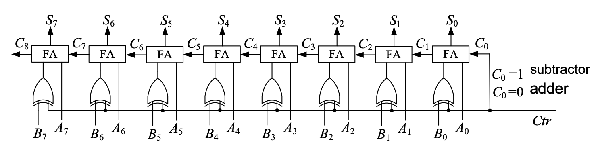

We'll design our 4-bit full adder-subtractor *AddSub4b* according to this diagram, which will be shown in the later section.

#### 2.2.5 4-bit Arithmetic and Logic Unit (ALU)

An Arithmetic and Logic Unit, so-called an ALU, is an essential and very important component in a Central Processing Unit (CPU). An ALU is supposed to be capable of:

1. **Arithmetic Operations:** Calculate addition & subtraction between 2 input numbers and output the result.
2. **Logic Operations:** Conduct AND & OR operations of 2 input data and give the result.

It's easy to infer that some **Multiplexers** must be used to **select** the output data source. Our ALU in this experiment looks like:

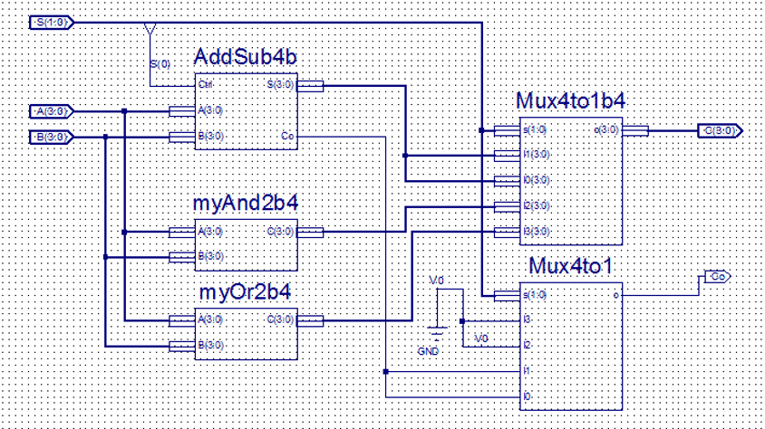

Since the implementation of modules *myAnd2b4* and *myOr2b4* is not given, it's also our task to design those modules.

#### 2.2.6 Some auxiliary modules

There're several auxiliary modules needed in order to implement our target function functional correct and user-friendly. They will be introduced and discussed in §4.3.

## §3 Main Instruments & Materials

### 3.1 Experiment Instruments

1. A Computer with ISE 14.7 Installed
2. SWORD Board

### 3.2 Experiment Materials

None.

## §4 Experiment Procedure & Operations

### 4.1 Design *4-bit Adder-Subtractor* using schematic diagram

1. Create a new ISE project named "*MyALU*" with Top Level Source Type *HDL*.

   **Note:** Both 2 tasks will be done in this same project.

2. Create a new Schematic source file named "*AddSub1b*".

3. Design *AddSub1b* module by drawing schematic diagram (as the figure below which is drawn by me myself). Then create schematic symbol of *AddSub1b* for later use.

   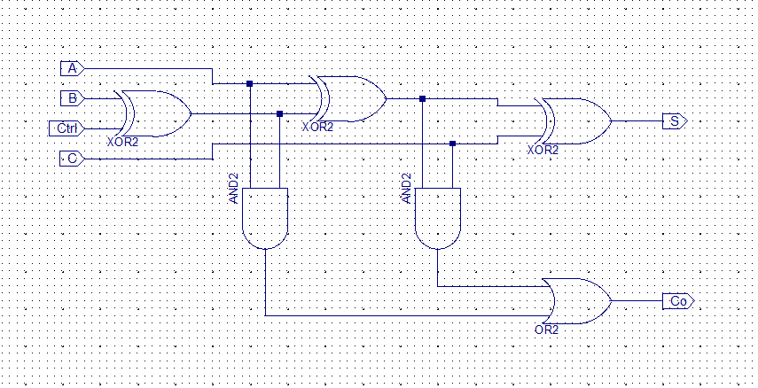

4. Create a new Schematic source file named "*AddSub4b*".

5. Design *AddSub4b* module by drawing schematic diagram, invoking the previously designed *AddSub1b* (as the figure below which is drawn by me myself).

   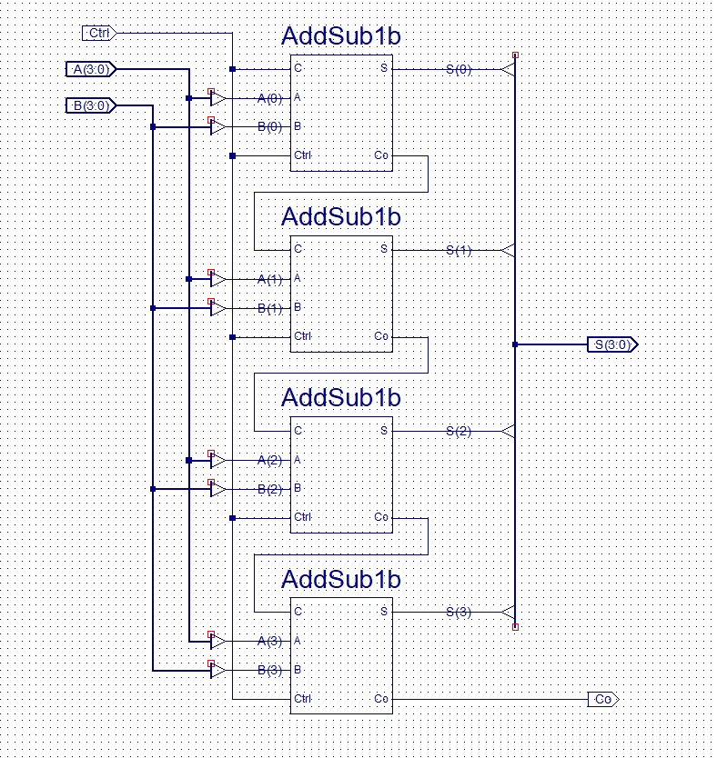

6. Use "Check Design Rules" to check if there's any design error.

7. (Selective) Run "View HDL Functional Model" to generate and see the Verilog HDL code of the design.

8. Run simulation on *AddSub4b* Module. Excitation code is as the following:

   **Note:** The excitation should cover all 4 operations (as commented in the code fence below) to check if the design is normally functioning.

   ```verilog
   `timescale 1ns / 1ps
   module AddSub4b_AddSub4b_sch_tb();
   
   // Inputs
      reg Ctrl;
      reg [3:0] A;
      reg [3:0] B;
       
   // Output
      wire [3:0] S;
      wire Co;
       
   // Instantiate the UUT (Unit Under Test)
      AddSub4b UUT (
   		.S(S), 
   		.Ctrl(Ctrl), 
   		.A(A), 
   		.B(B), 
   		.Co(Co)
      );
   // Initialize Inputs
   	initial begin
   		Ctrl = 0;
   		A = 0;
   		B = 0;
   		
   		// TestCase1: Addition, with no carry generated
   		A = 2;
   		B = 4;
   		#100;
   		// TestCase2: Addition, with carry generated
   		A = 9;
   		B = 14;
   		#100;
   		// TestCase3: Subtraction, with carry generated (No borrow)
   		Ctrl = 1;
   		A = 12;
   		B = 9;
   		#100;
   		// TestCase4: Subtraction, with no carry generated (Borrow)
   		A = 9;
   		B = 12;
   		#100;
   	end	
   endmodule
   ```

9. Create Schematic Symbol of *AddSub4b* for later use.

### 4.2 Implement *4-bit ALU Module*

2. Create new Schematic source file named "*ALUb4*".
2. To implement our ALU, we need modules *MyAND2b4* and *MyOR2b4*. So create new schematic source files and implement them by drawing the diagram. (as the following) Then create schematic symbols for our ALU.

<center>
   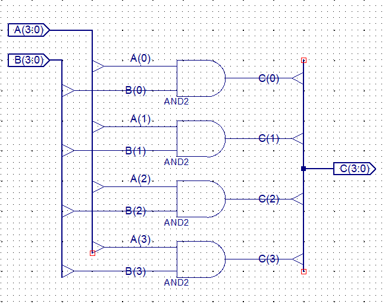 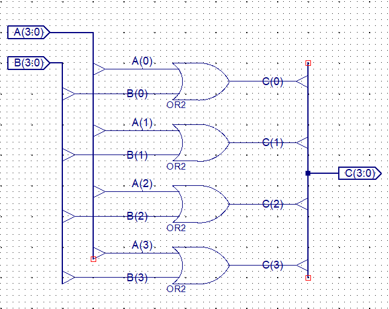
</center>

3. Use "Add Copy Of Source" to add symbol and schematic files of "*Mux4to1b4*" and "*Mux4to1*" which were implemented in Lab Experiment 7.

   **Note:** The ".sym" file only allows you to use the corresponding **symbol** in the schematic files of the current project, while the ".vf" or the ".sch" file is the one which **defines the function** of it. (So you only need either ".vf" or ".sch" along with the ".sym" file to make a user-designed component work.)

4. Make sure symbol "AddSub4b", "Mux4to1b4", "*Mux4to1*", "MyAND2b4" and "MyOR2b4" can be found in the "symbol" list (should be first ones).

5. We can finally design our ALU Module as the diagram shown below:

   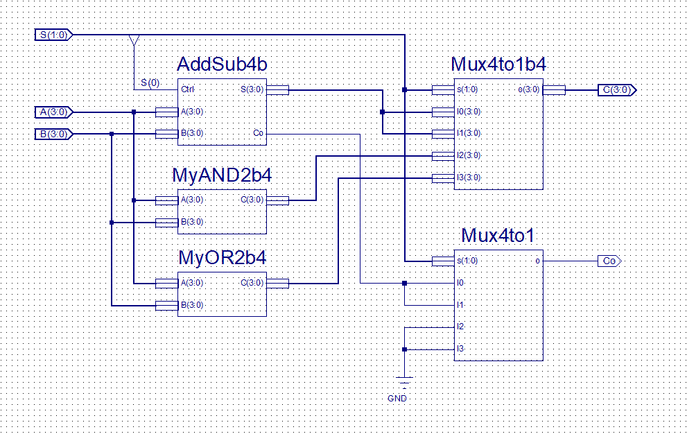

6. Use "Check Design Rules" to check if there's any design error.

7. Run simulation on `MyALU` Module. Excitation code is as the following:

   **Note:** The excitation code should cover all 4 operations (as commented in the code fence below) to check if the design is normally functioning.

   ```verilog
   `timescale 1ns / 1ps
   
   module ALUb4_ALUb4_sch_tb();
   // Inputs
      	reg [3:0] A;
      	reg [3:0] B;
      	reg [1:0] S;
   
   // Output
      	wire Co;
      	wire [3:0] C;
       
   // Instantiate the UUT
      	ALUb4 UUT (
   		.A(A), 
   		.B(B), 
   		.S(S), 
   		.Co(Co), 
   		.C(C)
      	);
   // Initialize Inputs
   	integer i;
   	initial begin
   		A = 0;
   		B = 0;
   		S = 0;
   		
   		A = 4'b1010;	B = 4'b0111;
   		#100;
   		B = 4'b0011;
           for ( i=0; i<4; i=i+1 ) begin	// Test all 4 cases
   			S = i;
   			#100;
   		end
   	end
   endmodule
   ```


### 4.3 Sum all things up and make them Operable

1. Create new Verilog Module source file "*Top.v*".

2. Right-click the module *Top* and **Set it as Top Module**.

3. Add copy of source "*clkdiv.v*", "*disp_num.v*" and "*CreateNumber.v*".

4. Modify the `CreateNumber` Module so that we can not only use buttons to increase a digit, **but also decrease** it using a single button.

   The original `CreateNumber` Module was like:

   ```verilog
   module CreateNumber(
   	input wire [3:0] btn,
   	output reg [15:0] num
   	);
   	wire [3:0] A,B,C,D;
   	
   	initial num <= 16'b1010_1011_1100_1101;
   	
   	assign A = num[3:0]   + 4'd1;
   	assign B = num[7:4]   + 4'd1;
   	assign C = num[11:8]  + 4'd1;
   	assign D = num[15:12] + 4'd1;
   	
   	always @ (posedge btn[0]) num[3:0]   <= A;
   	always @ (posedge btn[1]) num[7:4]   <= B;
   	always @ (posedge btn[2]) num[11:8]  <= C;
   	always @ (posedge btn[3]) num[15:12] <= D;
   
   endmodule
   ```

   We can see that its 9-12 rows were the statements that implemented the "increase by 1" function. To obtain our target function as stated above, we need to modify those rows with our *AddSub4b* Module, and of course, add 4 switches `wire [3:0] sw` to determine on which mode should the `CreateNumber` module operate:

   ```verilog
   module CreateNumber(
   	...
       input wire [3:0] sw,
       ...);
       
       ...
   	AddSub4b a1(.A(num[ 3: 0]), .B(4'b1), .Ctrl(sw[0]), .S(A));
   	AddSub4b a2(.A(num[ 7: 4]), .B(4'b1), .Ctrl(sw[1]), .S(B));
   	AddSub4b a3(.A(num[11: 8]), .B(4'b1), .Ctrl(sw[2]), .S(C));
   	AddSub4b a4(.A(num[15:12]), .B(4'b1), .Ctrl(sw[3]), .S(D));
       ...
       
   endmodule
   ```

5. Create a new Module `pbdebounce` for a *Button Anti-jitter* (VERY IMPORTANT!)

   1. The **reason** for an anti-jitter: When a button is pressed down or bounce up, there'd be a **mechanical vibration**. And the period of the vibration is usually between 10~20ms.
   2. The **principle** of an anti-jitter: DELAY to judge the status of buttons to get rid of those mechanical vibrations.

   A anti-jitter can be implemented by the following code block:

   ```verilog
   module pbdeBounce(
       input wire clk_1ms,
       input wire button,
       output reg pbreg
       );
   
       reg [7:0] pbshift;
   
       always @ (posedge clk_1ms) begin
           pbshift = pbshift << 1;
           pbshift[0] = button;
           if ( pbshift == 8'b0 ) pbreg = 0;
           if ( pbshift == 8'hFF ) pbreg = 1;
       end
   
   endmodule
   ```

   Since the input clock period is 1ms, the code above means that one needs to be continuously pressing a button for at least **8ms** to trigger a button. This module is really helpful because we want to decide when a digit should be increased *by ourselves* rather than *by the mechanical vibration*.

6. Now we have all needed modules for our user-friendly project. Sum things up in "Top.v" as the following:

   ```verilog
   module top(
   	input wire clk,
   	input wire [1:0] FuncSW,	// Control functions (00-Addition, 01-Subtraction, 10-AND, 11-OR)
   	input wire [1:0] btn,		// Press to Increase / Decrease
   	input wire [1:0] SW,		// Determine the Increasing / Decreasing mode of the operands
   	output wire [3:0] AN,
   	output wire [7:0] SEG,
   	output wire BTNX4			// Low-voltage Enable of buttons
   	);
   	wire [15:0] num;
   	wire [1:0] btn_out;
   	wire [3:0] C;
   	wire Co;
   	wire [31:0] clk_div;
   
   	pbdeBounce m0(clk_div[17], btn[0], btn_out[0]);
   	pbdeBounce m1(clk_div[17], btn[1], btn_out[1]);
   	
   	clk_div m2(clk, 1'b0, clk_div);
   
   	CreateNumber c0({2'b0,btn_out[1],btn_out[0]}, {2'b0,SW[1],SW[0]}, num);
   	
   	ALUb4 m5(num[7:4], num[3:0], FuncSW, C, Co);
   	
   	disp_num d0(clk, {num[7:0],3'b0,Co,C}, 4'b0, 4'b0, 1'b0, AN, SEG);
   	assign BTNX4 = 0;	// Assign this 0 to make on-board buttons valid
   
   endmodule
   ```

   **Note:** Usage of `BTNX4`: Since we need to use buttons on the SWORD Board, we need an output (`BTNX4` in this case) which is connected to *rows* of the keypad to ENABLE (set to 0) that row of buttons. When a row of buttons are enabled and *columns* of buttons are connected to top module inputs, our module becomes able to detect input signals generated by a button located in a certain row and a certain column.

   We can see from the code fence above that *Switch Inputs* are separated into two wire variables `FuncSW` and `SW`. This action may be helpful to determine functions of each switch used.

7. Create the **User Constraint File**, generate programming file and upload the design to the SWORD Board and verify the function of `MyALU` Module. The correspondence of the I/O and  the Pins can be seen in **"Pinout Report"** in **"Design Summary"**. The **User Constraint File** (UCF) is as follows:

   **Note:** Remember to write `NET "btn[i]" clock_dedicated_route = false` in order to make that column of buttons usable.

   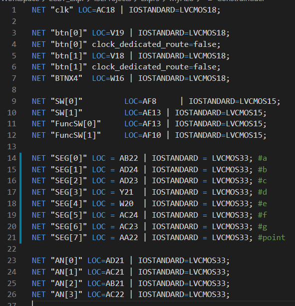

8. Operate on the SWORD Board according to the truth table to verify whether the module implemented the desired function.

## §5 Results & Analysis

### 5.1 Design *4-bit Adder-Subtractor* using schematic diagram

1. "Check Design Rules" on module `AddSub4b` didn't return any errors.

2. The created symbol of "*AddSub4b*" looks like:

   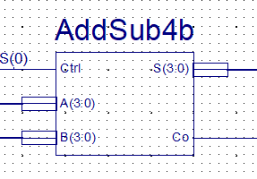

3. Simulation result was as the following:

   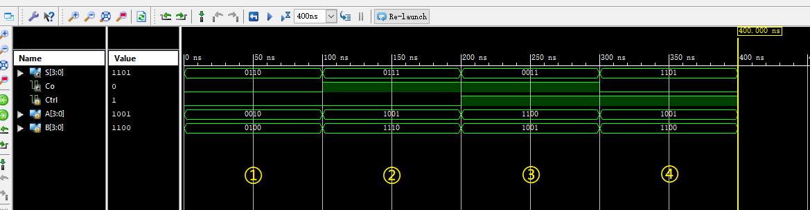

**Analysis:** From the simulation, we can see that the *AddSub4b Module* implemented our target function.

### 5.2 Implement *4-bit ALU Module*

1. The created symbol of "*MyAND2b4*" and "*MyOR2b4*" looks like:

   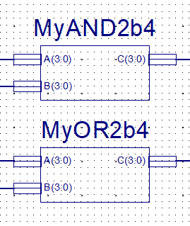

2. "Check Design Rules" on module `MyALU` didn't return any errors.

3. Simulation result was as the following:

   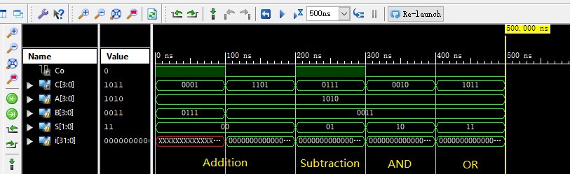

**Analysis:** From the simulation, we can see that the *MyALU Module* implemented our target function.

### 5.3 Sum all things up and make them Operable

1. After modifying user constraint file, the correspondence of the I/O and the Pins (Pinout Report) is as shown in the following figure.

   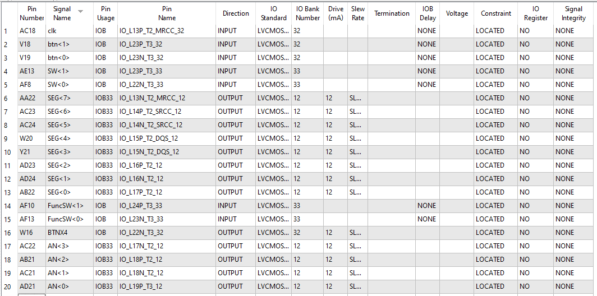

2. The Top Module passed all checks and the programming file was generated successfully.

3. After uploading and operating on the SWORD Board, it was clear that the Top Module worked correctly. All input combinations and outputs satisfied the truth table.

   **Note:** I used the **leftmost 2 switches** to control the mode of `MyALU`, which will be shown in the following pictures.

   **Addition:**

   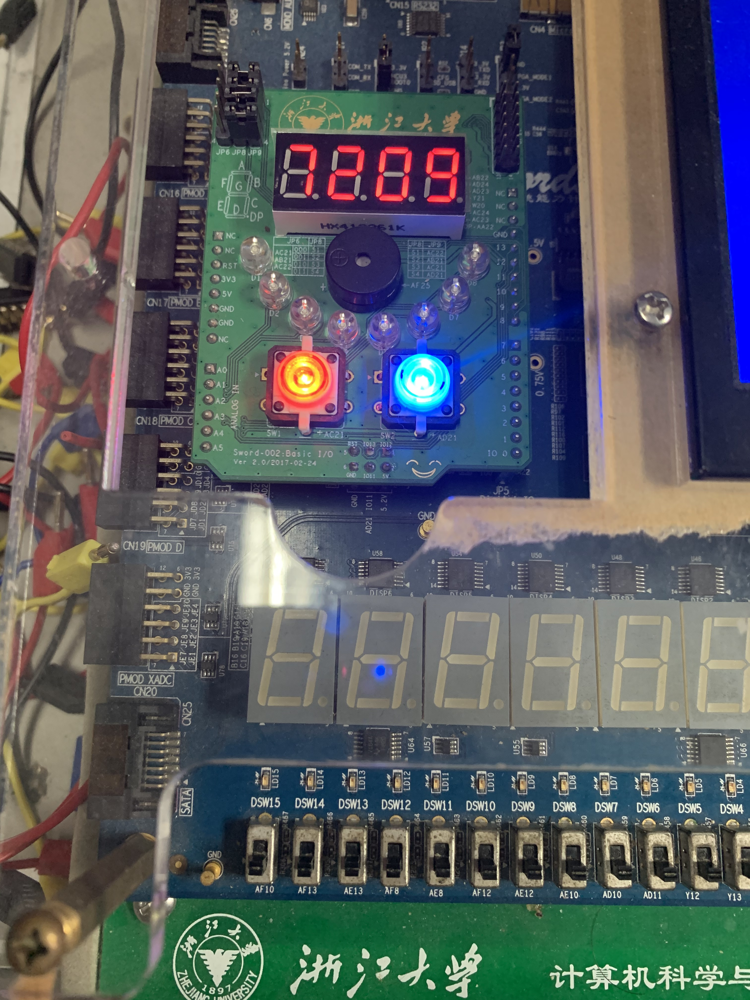

   **Subtraction:**

   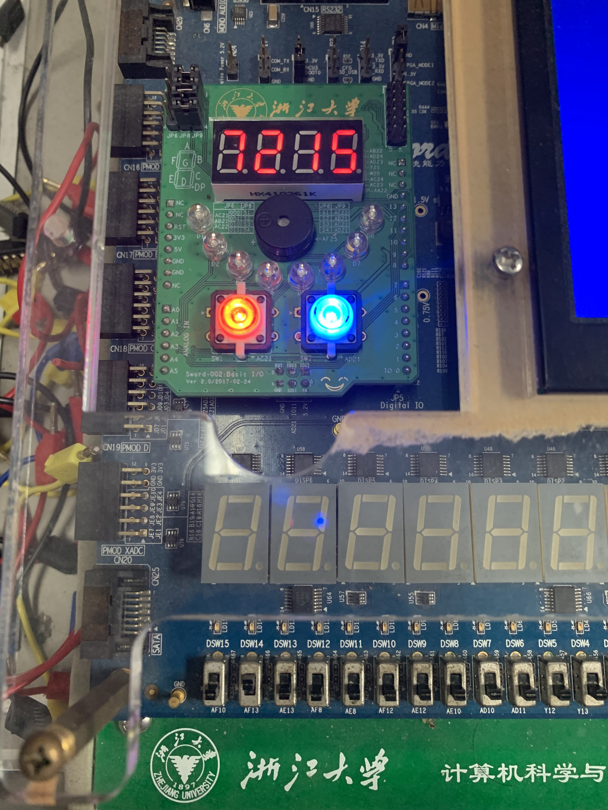

   **AND Operation:**
   
   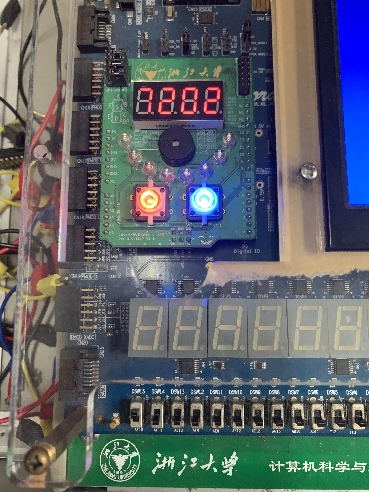
   
   **OR Operation:**
   
   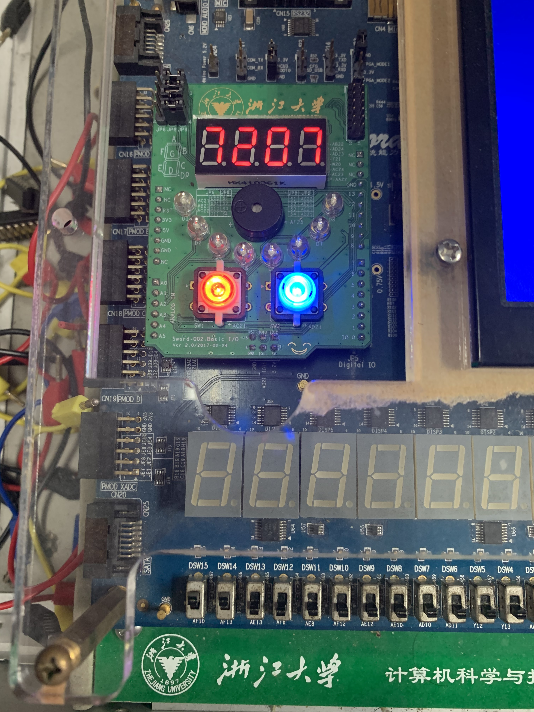

**Analysis:** It can be seen from above pictures that our design has passed the physical verification. And so far, the desired functions of this experiment which were:

1. Operands A & B should be 4-bit;
2. Use two buttons for self-increment / decrement of two operands;
3. Obtain operation result C and carry Co with a self-designed 4-bit ALU;
4. Display A, B, C and Co to the 7-segment digital tube displays.

were correctly implemented. The experiment was successful.

<div style="page-break-after: always;"></div>