<center>
    <font face="Impact" size="4"><h1>Logic and Computer Design Fundamentals</h1></font>
    <h1>Experiment 8-11 Lab Report</h1>
</center>

<table align="center">
    <tr>
        <th align="center">Name:</th>
        <td>王浚哲</td>
        <th align="center">ID:</th>
        <td>3180103011</td>
        <th align="center">Major:</th>
        <td>Computer Science & Technology</td>
    </tr>
    <tr>
        <th align="center">Course:</th>
        <td colspan="3">Logic & Computer Design Fundamentals</td>
        <th align="center">Groupmate:</th>
        <td>朱雨轩</td>
    </tr>
    <tr>
        <td align="center"> <b>Date:</b> </td>
        <td> 2019-11-13/20/27</td>
        <td align="center"> <b>Place:</b> </td>
        <td> East 4-509 </td>
        <td align="center"> <b>Instructor:</b> </td>
        <td> 洪奇军</td>
    </tr>
</table>

# Expr10. Principle and Design of Latches and Flip-Flops

## §1 Purposes & Requirements

1. Master the formation condition and the principle of several kinds of **Latches** and **Flip-Flops**.
2. Master the difference between Latches and Flip-Flops.
3. Master the basic functions of *Basic SR Latch*, *Gated SR Latch*, *D latch*, *SR Master-Slave Flip-Flop* and *D Flip-Flop*.
4. Explore the existing timing problem of *Basic SR Latch*, *Gated SR Latch*, *D Latch,* *SR Master-Slave Flip-Flop* and *D Flip-Flop*.

## §2 Principle & Tasks

### 2.1 Experiment Tasks

1. Implement *Basic SR Latch*, verify its function and understand its timing problems.
2. Implement *Gated SR Latch*, verify its function and understand its timing problems.
3. Implement *D Latch*, verify its function and understand its timing problems.
4. Implement *SR Master-Slave Flip-Flop*, verify its function and understand its timing problems.
5. Implement *D Flip-Flip* and verify its function.

### 2.2 Experiment Principle

#### 2.2.1 Latches Introduction

- Sufficient conditions to compose a Latch are:
  1. The device can maintain a given state for a long term;
  2. The device has two stable states: 0 and 1;
  3. The device can change its state asynchronously under certain conditions.
- Most basic latch types are: *SR Latch* and *D Latch*.

Since a latch has two stable states, it's also called as a **bistable circuit**.

#### 2.2.2 SR Latch

Connect inputs and outputs of two *input inverting logic components* crosswise, and use the other input as the external information input. This constitutes the simplest *SR Latch*.

Since we have both *NOR Gates* and *NAND Gates* as the *input inverting logic components*, there're two different ways to implement our simplest *SR Latch*. Their schematics and state tables are as follows:

##### 1. NOR SR Latch:

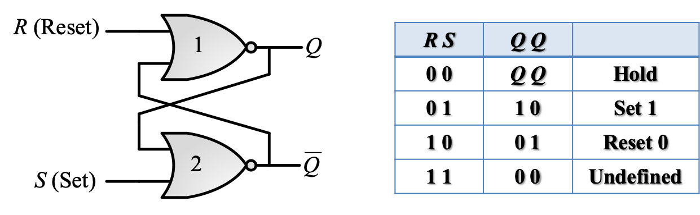

##### 2. NAND SR Latch:

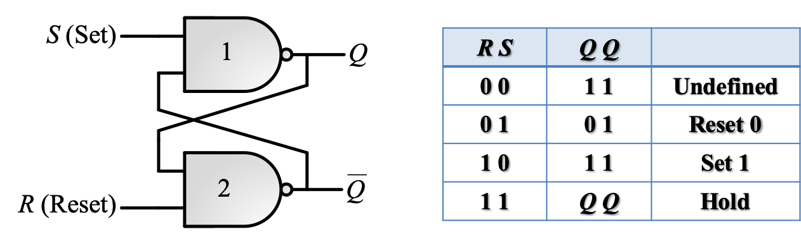

#### 2.2.3 Gated SR Latch

As you may imagine, the simplest *SR Latch* is an **asynchronous** circuit, which means it will change its state whenever the input changes (if defined). The *Gated SR Latch* added a *Control (Clock)* input to determine when the state of the latch should change so that it can be used in a **synchronous** circuit. To implement that function, we add 2 more NAND Gates to the simplest SR Latch shown above, which is like:

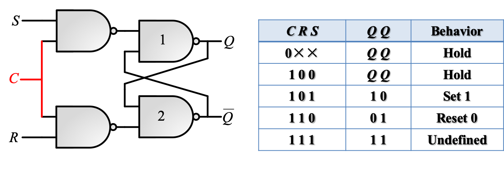

The state table tells us that the state of the latch can only be changed during the interval when C = 1.

#### 2.2.4 D Latch

The disadvantage of a *SR Latch* is obvious: it has an **undefined** behavior, which may cause fatal unstable circuit states (e.g. oscillation) and break the entire system down. Fortunately, the solution is also obvious: eliminating the undefined state. That is what a *D Latch* is designed for. 

The *D Latch* has just 1 data input, to which the output is equal. And it also support a control signal, which means that it can be used in a synchronous circuit as well.

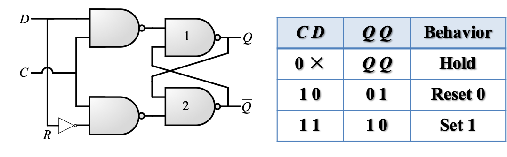

#### 2.2.5 Flip-Flop Introduction

There's also a disadvantage about a *D Latch* — it has a phenomenon which is known as **"Data Flip"**. That is, if we use D Latches in a sequential circuit, as long as the *control signal* is valid, the state of the D Latch would change **whenever** the input $D$ changes, rather than remain the original state which is wanted.

Therefore, in order to eliminate the Data Flip phenomenon, we need to come up with a circuit that only changes its internal state 1 time for each *trigger*.

- Trigger(v.): To enable a latch to change its internal state in a transient time interval when an external input comes.
- Trigger(n.): A latch circuit (bistable) which is on the basis of latches and changes its internal state only one time for each trigger.

**The common classification of Flip-Flops:**

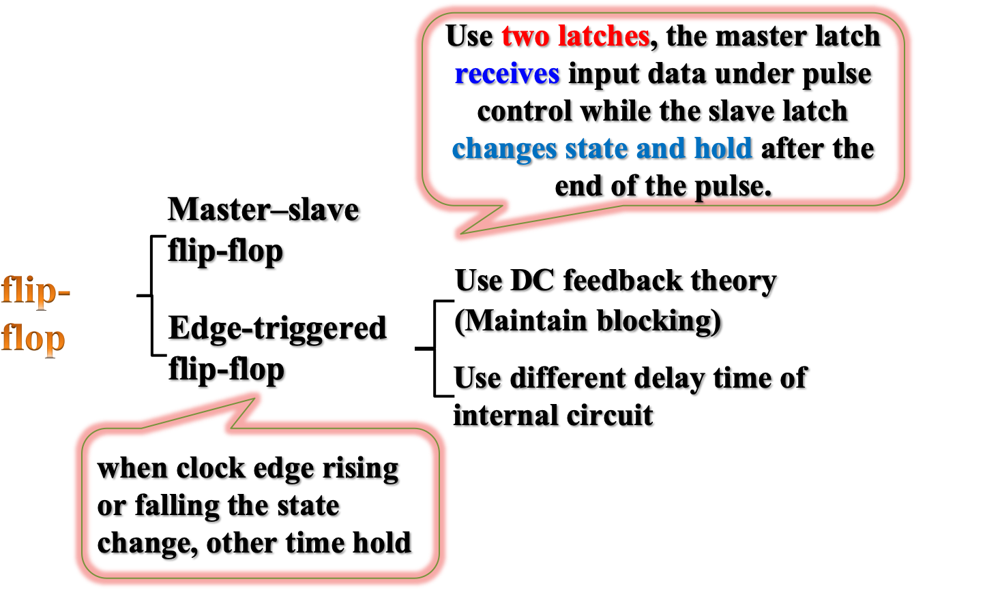

Common flip-flops are *Master-Slave SR Flip-Flop*, *D Flip-Flop*, *JK Flip-Flop* and *T Flip-Flop*. However we'll only implement the first two in this experiment.

#### 2.2.6 Master-Slave SR Flip-Flop

An *SR Master-Slave Flip-Flop* is comprised by two clock-controlled *SR Latch* series with the clock signal of the second latch inverted. The following diagram shows its structure:

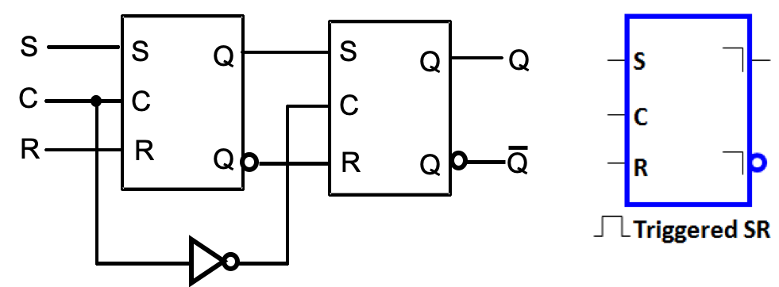

Its behavior follows the following loop:

- When C = 1, the input signal is detected by the left latch (so-called Master latch).
- When C = 0, the output signal of the Master Latch is detected by the right latch (so-called Slave latch) and it produces the final output $Q$.

It can be seen that the path from input to the final output is separated by different clock signal values, so that the "Data Flip" wouldn't propagate all the way through the device.

#### 2.2.7 Positive-Edge Maintain Obstructive D Flip-Flop

Although the *Master-Slave SR Flip-Flop* solved the problem of Data Flip, it has another problem, known as "**1's Catching**". Its shown in the following figure:


The figure above illustrates that if there's a sudden signal of S or R (shorter than the *Control / Clock Signal*), the final output may become something isn't expected.

To solve that problem, we can design some circuit that is only active **at** the edge of the control signal. So, we introduce the *Positive-Edge Maintain Obstructive D Flip-Flop*, which is triggered only at the positive-edge of the $C_P$ signal:

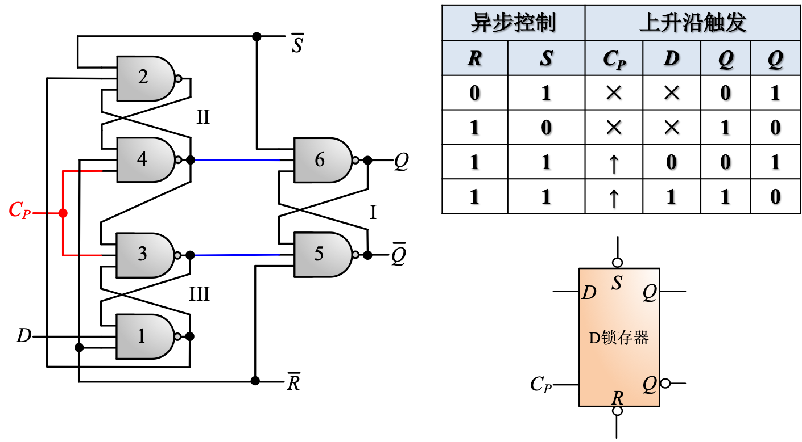

## §3 Main Instruments & Materials

### 3.1 Experiment Instruments

1. A Computer with ISE 14.7 Installed
2. SWORD Board

### 3.2 Experiment Materials

None.

## §4 Experiment Procedure & Operations

### 4.1 Implement *Basic SR Latch*, verify its function and understand its timing problems.

1. Create a new ISE project named "*MyLATCHS*".

   **Note:** Both 5 tasks will be done in this same project.

2. Create a new Schematic source file named "*SR_Latch.sch*".

3. Design the module according to the schematic diagram, using NAND2 Gates.

   

4. Run simulation on `SR_Latch` module, main part of the excitation codes are as follows:

   ```verilog
   // Initialize Inputs
   	initial begin
   		R = 1;	S = 1;	#50;
   		R = 1;	S = 0;	#50;
   		R = 1;	S = 1;	#50;
   		R = 0;	S = 1;	#50;
   		R = 1;	S = 1;	#50;
   		R = 0;	S = 0;	#50;
   		R = 1;	S = 1;	#50;
   	end
   ```

### 4.2 Implement *Gated SR Latch*, verify its function and understand its timing problems.

1. Create a new Schematic source file named "*CSR_Latch.sch*".
2. Design the module according to the schematic diagram, using NAND2 Gates.


3. Run simulation on `CSR_Latch` module, show the **Data Flip** phenomenon. Main part of the excitation codes are as follows:

   ```verilog
// Initialize Inputs
	initial begin
		C = 0;
		S = 0;
		R = 0;
		
		#50 S = 1;
		#50 C = 1;
		#50 S = 0;
		#20 R = 1;
		#40 R = 0;
		#50 S = 1;
		#50 C = 0;
		#20 S = 0;
	end
   ```

2. Generate schematic symbol of `CSR_Latch` module for later use in `MS_FlipFlop`.

### 4.3 Implement *D Latch*, verify its function and understand its timing problems.

1. Create a new Schematic source file named "*D_Latch.sch*".

2. Design the module according to the schematic diagram, using NAND2 Gates.

   

3. Run simulation on `D_Latch` module, show the **Data Flip** phenomenon. Main part of the excitation codes are as follows:

    ```verilog
    // Initialize Inputs
        initial begin
            C = 0;
            D = 0;

            #50 D = 1;
            #50 C = 1;
            #50 D = 0;
            #50 D = 1;
            #50 C = 0;
            #20 D = 0;
        end
    ```

### 4.4 Implement *SR Master-Slave Flip-Flop*, verify its function and understand its timing problems.

1. Create a new Schematic source file named "*MS_FlipFlop*".

2. Design the module according to the schematic diagram, invoking the `CSR_Latch` module.

   

3. Run simulation on `MS_FlipFlop` module, show the **1's Catching** phenomenon. Main part of the excitation codes are as follows:

   ```verilog
   // Initialize Inputs
   	always begin
   		#50 C = ~C;
   	end
   	
   	initial begin
   		C = 0;
   		#40 S = 0;
   		R = 0;
   		#100 S = 1;
   		#100 S = 0;
   		#100 R = 1;
   		#100 R = 0;
   		#100 S = 1;	#20 S = 0;
   		#5	  R = 1;	#15 R = 0;
   		#60  S = 1;	#20 S = 0;
   		#140 S = 1; R = 1;
   		#100 S = 0; R = 0;
   	end
   ```


### 4.5 Implement *D Flip-Flip* and verify its function.

1. Create a new schematic source file named as "*D_FlipFlop*"

2. Design the module according to the schematic diagram, using NAND3 Gates.

   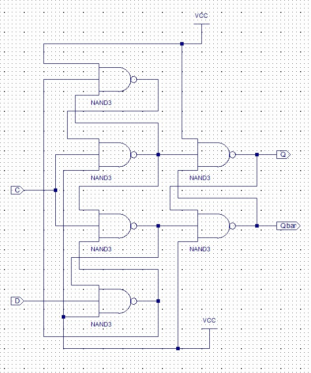

3. Run simulation on `D_FlipFlop` module. Main part of the excitation codes are as follows:

   ```verilog
   // Initialize Inputs
   	initial begin
   		C = 0;
   		D = 0;
   		#125 D = 1;
   		#100 D = 0;
   	end
   	
   	always begin
   		#50 C = ~C;
   	end
   ```

## §5 Results & Analysis

### 5.1 Implement *Basic SR Latch*, verify its function and understand its timing problems.

The simulation result was as the follows:


**Analysis:** From the simulation, we can see that the `SR_Latch` Module implemented our desired function.

### 5.2 Implement *Gated SR Latch*, verify its function and understand its timing problems.

The simulation result was as the follows:


**Analysis:** From the simulation, we can see that the `CSR_Latch` Module implemented our desired function. And the *Data Flip* phenomenon can be seen from the diagram clearly (100ns ~ 300ns).

### 5.3 Implement *D Latch*, verify its function and understand its timing problems.

The simulation result was as the follows:

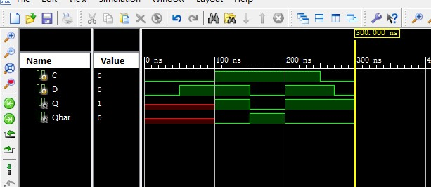

**Analysis:** From the simulation, we can see that the `D_Latch` Module implemented our desired function. And the *Data Flip* phenomenon can be seen from the diagram clearly(100ns ~ 300ns).

### 5.4 Implement *SR Master-Slave Flip-Flop*, verify its function and understand its timing problems.

The simulation result was as the follows:

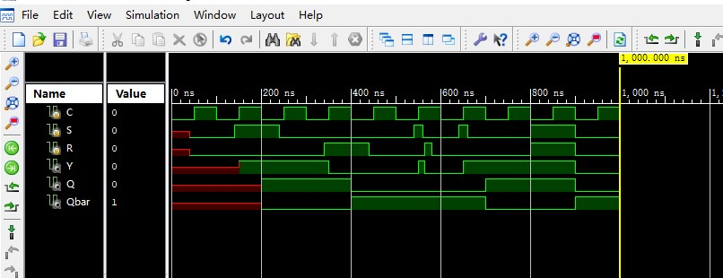

**Analysis:** From the simulation, we can see that the `MS_FlipFlop` Module implemented our desired function. And the *1's Catching* phenomenon can be seen from the diagram clearly (520ns ~ 660ns).

### 5.5 Implement *D Flip-Flip* and verify its function.

The simulation result was as the follows:

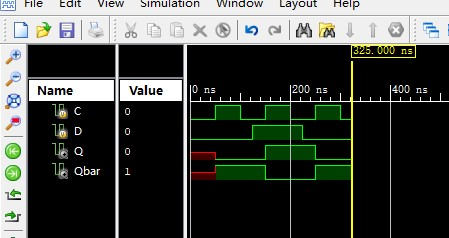

**Analysis:** From the simulation, we can see that the `D_FlipFlop` Module implemented our desired function. The experiment was successful.

<div style="page-break-after: always;"></div>