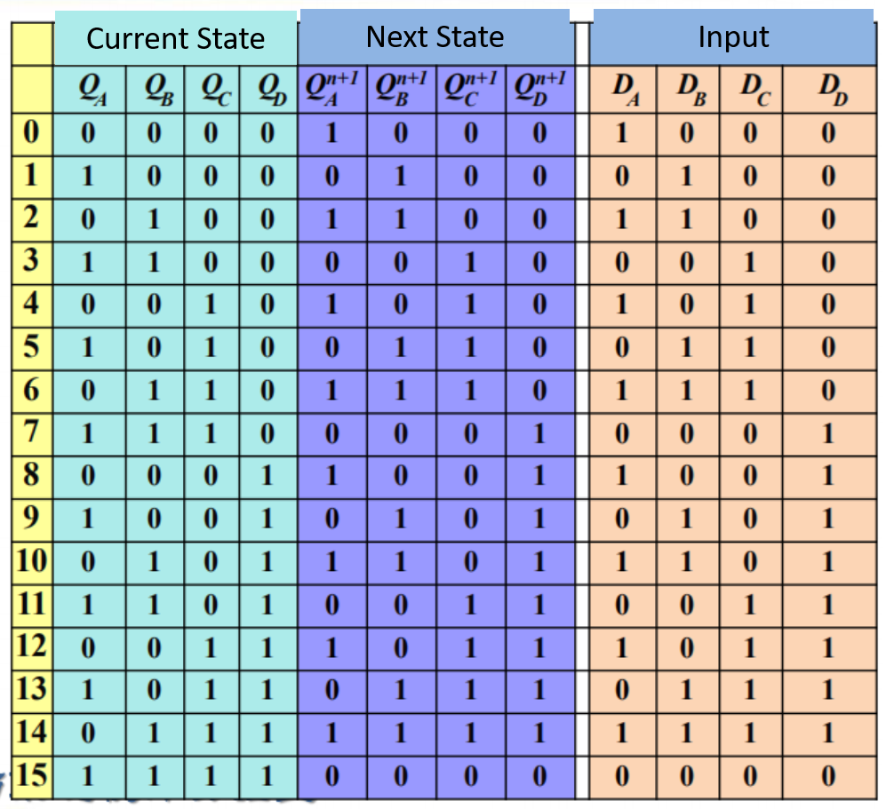
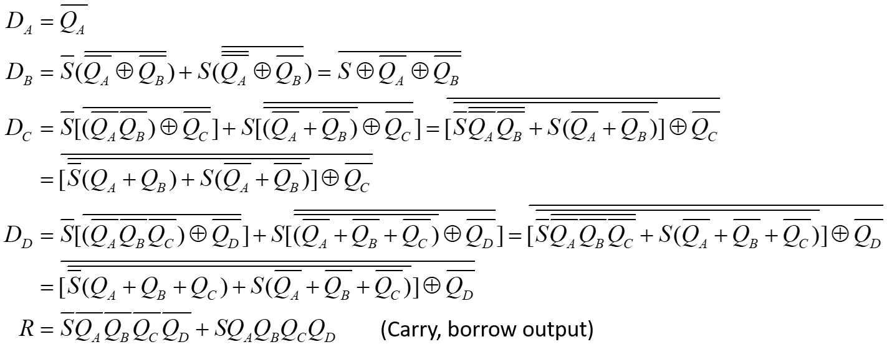
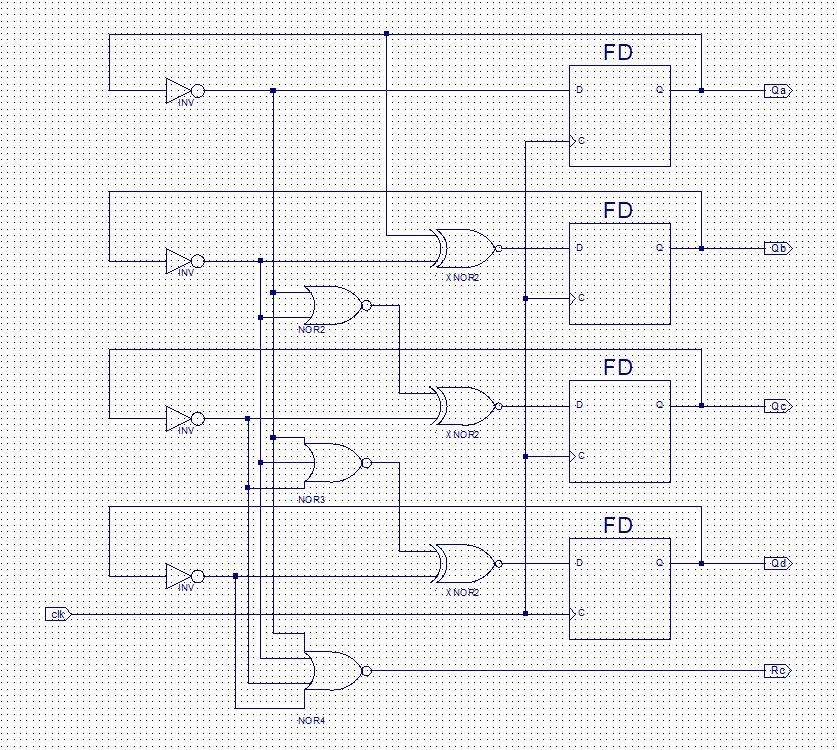
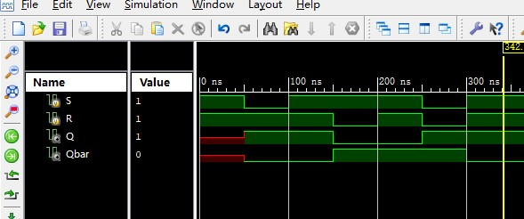
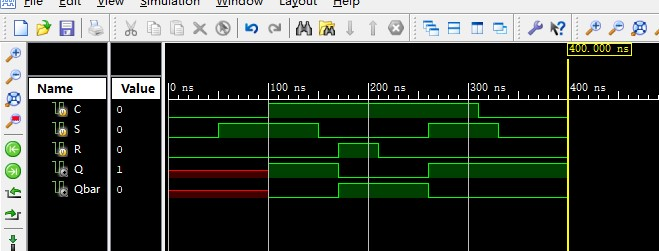

# Expr11. Design of Synchronous Sequential Circuits

<table align="center">
    <tr>
        <th align="center">Name:</th>
        <td>王浚哲</td>
        <th align="center">ID:</th>
        <td>3180103011</td>
        <th align="center">Major:</th>
        <td>Computer Science and Technology</td>
    </tr>
    <tr>
        <th align="center">Course:</th>
        <td colspan="3">Logic and Computer Design Fundamentals</td>
        <th align="center">Groupmate:</th>
        <td>朱雨轩</td>
    </tr>
    <tr>
        <td align="center"> <b>Date:</b> </td>
        <td> 2019-11-27</td>
        <td align="center"> <b>Place:</b> </td>
        <td> East 4-509 </td>
        <td align="center"> <b>Instructor:</b> </td>
        <td> 洪奇军</td>
    </tr>
</table>

## §1 Purposes & Requirements

1. Master the principle and typical design of synchronous sequential circuits.
2. Master the application of excitation functions, state diagrams and state equations of sequential circuits.
3. Master the design, debug and simulation of *finite state machine* with Verilog HDL.
4. Master the implementation of sequential circuits with FPGA.

## §2 Principle & Tasks

### 2.1 Experiment Tasks

1. Implement a 4-bit binary synchronous counter using schematic diagram.
2. Implement a 16-bit reversible binary synchronous counter.

### 2.2 Experiment Principle

#### 2.2.1 4-bit Binary Synchronous Counter

A *Binary Synchronous Counter* is a sequential circuit which increase its own output binary code by 1 every time the *Clock Signal* is 1. 

From its function, we obtain its state table:



After K-map simplification of all the 4 outputs, we now have state functions for all next states of the counter:
$$
Q_A^{n+1} = \overline{Q_A} \\
Q_B^{n+1} = \overline{\overline{Q_A} \otimes \overline{Q_B}} \\
Q_C^{n+1} = \overline{ ( \overline{\overline{Q_A} + \overline{Q_B} ) } \otimes \overline{Q_C}} \\
Q_D^{n+1} = \overline{ ( \overline{\overline{Q_A} + \overline{Q_B} + \overline{Q_C} ) } \otimes \overline{Q_D}} \\
$$
And the output function for carry *Rc*:
$$
R_C = \overline{ \overline{Q_A} + \overline{Q_B} + \overline{Q_C} + \overline{Q_D} } = Q_A Q_B Q_C Q_D\\
$$
According to these output functions, we will design the *4-bit Binary Synchronous Counter* using schematic in $\sect4$.

#### 2.2.2 4-bit Reversible Binary Synchronous Counter

The *Reversible Binary Synchronous Counter* can be controlled by $S$ to select in forward mode or reversed mode should the counter counts.

- When S = 1, the counter counts in the ascending mode.
- When S = 0, the counter counts in the descending mode.

A 4-bit reversible counter has output functions like this:



Since all the functions above is definitely making people dizzy and no one  is willing to do all those wirings, we'll use *Behavior Description* to implement the reversible counter. See $\sect4$.

#### 2.2.3 Auxiliary Module: Frequency Divider

We've known from previous experiments that the SWORD Board generates clock signals at a frequency of **100MHz**, but obviously we don't want our counters do those counts every 1/100,000,000s. Thus we need to design a module that helps us reduce the frequency input to our counters to a human-acceptable range (e.g. 1~10Hz).

The system-generated clock of 100MHz will be divided by 50,000,000 time to obtain a 1Hz square wave which will be used to trigger our counters.

The codes of implementation can be seen in $\sect4$.

## §3 Main Instruments & Materials

### 3.1 Experiment Instruments

1. A Computer with ISE 14.7 Installed
2. SWORD Board

### 3.2 Experiment Materials

None.

## §4 Experiment Procedure & Operations

### 4.1 Implement a 4-bit binary synchronous counter using schematic diagram

1. Create a new ISE project named "*MyCounter*" with Top Level Source Type *HDL*.

2. Create a new Schematic source file named "*Counter4b*".

3. Design the module according to the schematic diagram.

   

4. Run simulation on `Counter4b` module, main part of the excitation codes are as follows:

   ```verilog
   // Initialize Inputs
   	initial clk = 0;
   	always begin
   		#20 clk = ~clk;
   	end
   ```
   
5. Create clock

6. Top

### 4.2 Implement a 16-bit reversible binary synchronous counter

1. Create a new ISE project named "*MyRevCounter*" with Top Level Source Type *HDL*.

2. Create a new Verilog HDL source file named "*RevCounter.v*".

   

3. Run simulation on `RevCounter` module, show the **Data Flip** phenomenon. Main part of the excitation codes are as follows:

   ```verilog
   // Initialize Inputs
   initial begin
   	C = 0;
   	S = 0;
   	R = 0;
   	
   	#50 S = 1;
   	#50 C = 1;
   	#50 S = 0;
   	#20 R = 1;
   	#40 R = 0;
   	#50 S = 1;
   	#50 C = 0;
   	#20 S = 0;
   end
   ```

4. 100ms clock

5. Top module

## §5 Results & Analysis

### 5.1 Implement a 4-bit binary synchronous counter using schematic diagram

The simulation result was as the follows:



**Analysis:** From the simulation, we can see that the `SR_Latch` Module implemented our desired function.

### 5.2 Implement a 16-bit reversible binary synchronous counter

The simulation result was as the follows:



**Analysis:** From the simulation, we can see that the `CSR_Latch` Module implemented our desired function. And the *Data Flip* phenomenon can be seen from the diagram clearly (100ns ~ 300ns).

<div style="page-break-after: always;"></div>