<center>
    <font face="Impact" size="4"><h1>Logic and Computer Design Fundamentals</h1></font>
    <h1>Experiment 8-11 Lab Report</h1>
</center>

<table align="center">
    <tr>
        <th align="center">Name:</th>
        <td>王浚哲</td>
        <th align="center">ID:</th>
        <td>3180103011</td>
        <th align="center">Major:</th>
        <td>Computer Science & Technology</td>
    </tr>
    <tr>
        <th align="center">Course:</th>
        <td colspan="3">Logic & Computer Design Fundamentals</td>
        <th align="center">Groupmate:</th>
        <td>朱雨轩</td>
    </tr>
    <tr>
        <td align="center"> <b>Date:</b> </td>
        <td> 2019-11-13/20/27</td>
        <td align="center"> <b>Place:</b> </td>
        <td> East 4-509 </td>
        <td align="center"> <b>Instructor:</b> </td>
        <td> 洪奇军</td>
    </tr>
</table>

# Table of Contents

[TOC]

# Expr8-9. Principle & Design of Adder, Adder-Subtractor and Arithmetic and Logic Unit (ALU)

## §1 Purposes & Requirements

1. Master the principle and logic function of 1-bit full adder.
2. Master the principle and carry delay of the ripple carry adder.
3. Master the principle and logic function of subtractor.
4. Master the design of adder-subtractors.
5. Master the principle of ALU and it’s function in the CPU.
6. Master the design of ALU.

## §2 Principle & Tasks

### 2.1 Experiment Tasks

1. Design *4-bit Adder-Subtractor* using schematic diagram.
2. Implement *4-bit ALU Module* and it's application.

### 2.2 Experiment Principle

#### 2.2.1 1-bit Full Adder

An 1-bit full adder implements the function of addition (with carry operand considered). And it has:

- 3 **inputs:** Data bit $A_i$ and $B_i$, and carry input $C_i$.

- 2 **outputs:** Current bit sum $S_i$ and the carry output $C_{i+1}$.

The truth table of a 1-bit full adder is as follows:

| $A_i$ | $B_i$ | $C_i$ | $S_i$ | $C_{i+1}$ |
| :---: | :--: | :--: | :--: | :--: |
| 0 | 0 | 0 | 0 | 0 |
| 0 | 0 | 1 | 1 | 0 |
| 0 | 1 | 0 | 1 | 0 |
| 0 | 1 | 1 | 0 | 1 |
| 1 | 0 | 0 | 1 | 0 |
| 1 | 0 | 1 | 0 | 1 |
| 1 | 1 | 0 | 0 | 1 |
| 1 | 1 | 1 | 1 | 1 |

From the truth table we can obtain the logic functions of $S_i$ and $C_{i+1}$:

$$
S_i = A_i \otimes B_i \otimes C_i	\\
C_{i+1} = A_iB_i + B_iC_i + C_iA_i
$$
And these functions enable us to design the 1-bit full adder module schematically in the later section.

#### 2.2.2 n-bit Ripple-Carry Full Adder

- N-bit full adder can be constructed by concatenating several 1-bit full adders.

- Since the carry is propagated bit-by-bit, results of more significant bits are produced slowly. And the delay is longer when the number of bits is bigger.

An intuitional diagram of a *n-bit Ripple-Carry Adder*:


We'll design our 4-bit full adder *Adder4b* according to this diagram, which will be shown in the later section.

#### 2.2.3 1-bit Full Adder-Subtractor

As we know, the target of a **subtractor** is to implement the function of *subtraction* — i.e. addition between a positive number and a negative one. 

To convert a positive number (subtrahend) to its *opposite number* for subtraction, we need to obtain its **2's complement** with some functional circuit which can:

1. **Invert** the subtrahend *bit-by-bit* to obtain its **1's complement**.
2. **Add 1** to the obtained number.

With the characteristic of XOR2 Gates which lets the XOR2 Gate to **invert** one input with 1 applied to the other input and **maintain** one input with 0 applied, we can use a *control signal* to decide whether to **"invert"** an input bit (subtrahend, for example). And based on a 1-bit Full Adder, when we also connect the *control signal* to the *Carry Input*, it **adds 1** to the result, which can be seen as adding 1 to the subtrahend as well, thus implements the operation of obtaining **2's complement of the subtrahend**. 

An intuitional diagram of Full Adder-Subtractor will be shown in the next section.

#### 2.2.4 n-bit Ripple-Carry Full Adder-Subtractor

- Using 2's complement addition, the subtrahend is regarded as its opposite number and converted to 2's complement. (Principle stated in 2.2.3.)

- The Adder-Subtractor shares the design of n-bit Ripple-Carry Full Adder.

- It uses XOR Gates with a *control signal* connected to do the invert action, and the least significant bit's carry $C_0$ is also connected to the *control signal*.
- When the *control signal Ctr* is 0, it runs on the **Adder Mode**. And when *Ctr* is 1, it runs on the **Subtractor Mode**, which can be simply switched by changing a switch.

A diagram of the n-bit Ripple-Carry Full Adder-Subtractor is as the following:

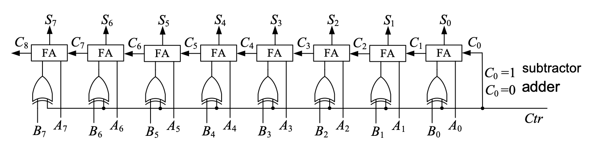

We'll design our 4-bit full adder-subtractor *AddSub4b* according to this diagram, which will be shown in the later section.

#### 2.2.5 4-bit Arithmetic and Logic Unit (ALU)

An Arithmetic and Logic Unit, so-called an ALU, is an essential and very important component in a Central Processing Unit (CPU). An ALU is supposed to be capable of:

1. **Arithmetic Operations:** Calculate addition & subtraction between 2 input numbers and output the result.
2. **Logic Operations:** Conduct AND & OR operations of 2 input data and give the result.

It's easy to infer that some **Multiplexers** must be used to **select** the output data source. Our ALU in this experiment looks like:


Since the implementation of modules *myAnd2b4* and *myOr2b4* is not given, it's also our task to design those modules.

#### 2.2.6 Some auxiliary modules

There're several auxiliary modules needed in order to implement our target function functional correct and user-friendly. They will be introduced and discussed in §4.3.

## §3 Main Instruments & Materials

### 3.1 Experiment Instruments

1. A Computer with ISE 14.7 Installed
2. SWORD Board

### 3.2 Experiment Materials

None.

## §4 Experiment Procedure & Operations

### 4.1 Design *4-bit Adder-Subtractor* using schematic diagram

1. Create a new ISE project named "*MyALU*" with Top Level Source Type *HDL*.

   **Note:** Both 2 tasks will be done in this same project.

2. Create a new Schematic source file named "*AddSub1b*".

3. Design *AddSub1b* module by drawing schematic diagram (as the figure below which is drawn by me myself). Then create schematic symbol of *AddSub1b* for later use.

   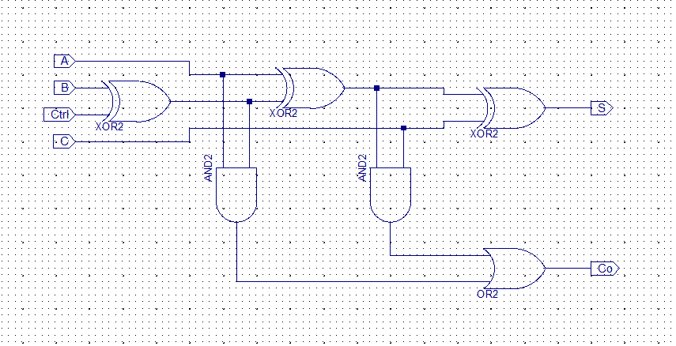

4. Create a new Schematic source file named "*AddSub4b*".

5. Design *AddSub4b* module by drawing schematic diagram, invoking the previously designed *AddSub1b* (as the figure below which is drawn by me myself).

   

6. Use "Check Design Rules" to check if there's any design error.

7. (Selective) Run "View HDL Functional Model" to generate and see the Verilog HDL code of the design.

8. Run simulation on *AddSub4b* Module. Excitation code is as the following:

   **Note:** The excitation should cover all 4 operations (as commented in the code fence below) to check if the design is normally functioning.

   ```verilog
   `timescale 1ns / 1ps
   module AddSub4b_AddSub4b_sch_tb();
   
   // Inputs
      reg Ctrl;
      reg [3:0] A;
      reg [3:0] B;
       
   // Output
      wire [3:0] S;
      wire Co;
       
   // Instantiate the UUT (Unit Under Test)
      AddSub4b UUT (
   		.S(S), 
   		.Ctrl(Ctrl), 
   		.A(A), 
   		.B(B), 
   		.Co(Co)
      );
   // Initialize Inputs
   	initial begin
   		Ctrl = 0;
   		A = 0;
   		B = 0;
   		
   		// TestCase1: Addition, with no carry generated
   		A = 2;
   		B = 4;
   		#100;
   		// TestCase2: Addition, with carry generated
   		A = 9;
   		B = 14;
   		#100;
   		// TestCase3: Subtraction, with carry generated (No borrow)
   		Ctrl = 1;
   		A = 12;
   		B = 9;
   		#100;
   		// TestCase4: Subtraction, with no carry generated (Borrow)
   		A = 9;
   		B = 12;
   		#100;
   	end	
   endmodule
   ```

9. Create Schematic Symbol of *AddSub4b* for later use.

### 4.2 Implement *4-bit ALU Module*

2. Create new Schematic source file named "*ALUb4*".
2. To implement our ALU, we need modules *MyAND2b4* and *MyOR2b4*. So create new schematic source files and implement them by drawing the diagram. (as the following) Then create schematic symbols for our ALU.

<center>
    
</center>

3. Use "Add Copy Of Source" to add symbol and schematic files of "*Mux4to1b4*" and "*Mux4to1*" which were implemented in Lab Experiment 7.

   **Note:** The ".sym" file only allows you to use the corresponding **symbol** in the schematic files of the current project, while the ".vf" or the ".sch" file is the one which **defines the function** of it. (So you only need either ".vf" or ".sch" along with the ".sym" file to make a user-designed component work.)

4. Make sure symbol "AddSub4b", "Mux4to1b4", "*Mux4to1*", "MyAND2b4" and "MyOR2b4" can be found in the "symbol" list (should be first ones).

5. We can finally design our ALU Module as the diagram shown below:

   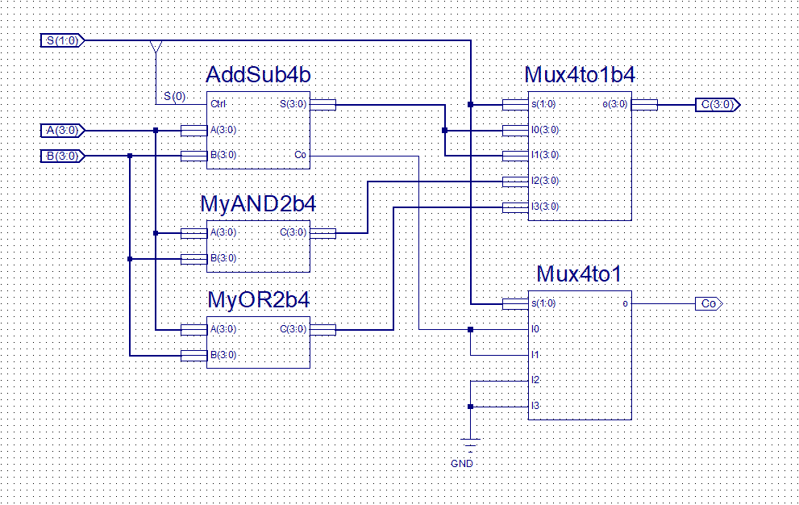

6. Use "Check Design Rules" to check if there's any design error.

7. Run simulation on `MyALU` Module. Excitation code is as the following:

   **Note:** The excitation code should cover all 4 operations (as commented in the code fence below) to check if the design is normally functioning.

   ```verilog
   `timescale 1ns / 1ps
   
   module ALUb4_ALUb4_sch_tb();
   // Inputs
      	reg [3:0] A;
      	reg [3:0] B;
      	reg [1:0] S;
   
   // Output
      	wire Co;
      	wire [3:0] C;
       
   // Instantiate the UUT
      	ALUb4 UUT (
   		.A(A), 
   		.B(B), 
   		.S(S), 
   		.Co(Co), 
   		.C(C)
      	);
   // Initialize Inputs
   	integer i;
   	initial begin
   		A = 0;
   		B = 0;
   		S = 0;
   		
   		A = 4'b1010;	B = 4'b0111;
   		#100;
   		B = 4'b0011;
           for ( i=0; i<4; i=i+1 ) begin	// Test all 4 cases
   			S = i;
   			#100;
   		end
   	end
   endmodule
   ```


### 4.3 Sum all things up and make them Operable

1. Create new Verilog Module source file "*Top.v*".

2. Right-click the module *Top* and **Set it as Top Module**.

3. Add copy of source "*clkdiv.v*", "*disp_num.v*" and "*CreateNumber.v*".

4. Modify the `CreateNumber` Module so that we can not only use buttons to increase a digit, **but also decrease** it using a single button.

   The original `CreateNumber` Module was like:

   ```verilog
   module CreateNumber(
   	input wire [3:0] btn,
   	output reg [15:0] num
   	);
   	wire [3:0] A,B,C,D;
   	
   	initial num <= 16'b1010_1011_1100_1101;
   	
   	assign A = num[3:0]   + 4'd1;
   	assign B = num[7:4]   + 4'd1;
   	assign C = num[11:8]  + 4'd1;
   	assign D = num[15:12] + 4'd1;
   	
   	always @ (posedge btn[0]) num[3:0]   <= A;
   	always @ (posedge btn[1]) num[7:4]   <= B;
   	always @ (posedge btn[2]) num[11:8]  <= C;
   	always @ (posedge btn[3]) num[15:12] <= D;
   
   endmodule
   ```

   We can see that its 9-12 rows were the statements that implemented the "increase by 1" function. To obtain our target function as stated above, we need to modify those rows with our *AddSub4b* Module, and of course, add 4 switches `wire [3:0] sw` to determine on which mode should the `CreateNumber` module operate:

   ```verilog
   module CreateNumber(
   	...
       input wire [3:0] sw,
       ...);
       
       ...
   	AddSub4b a1(.A(num[ 3: 0]), .B(4'b1), .Ctrl(sw[0]), .S(A));
   	AddSub4b a2(.A(num[ 7: 4]), .B(4'b1), .Ctrl(sw[1]), .S(B));
   	AddSub4b a3(.A(num[11: 8]), .B(4'b1), .Ctrl(sw[2]), .S(C));
   	AddSub4b a4(.A(num[15:12]), .B(4'b1), .Ctrl(sw[3]), .S(D));
       ...
       
   endmodule
   ```

5. Create a new Module `pbdebounce` for a *Button Anti-jitter* (VERY IMPORTANT!)

   1. The **reason** for an anti-jitter: When a button is pressed down or bounce up, there'd be a **mechanical vibration**. And the period of the vibration is usually between 10~20ms.
   2. The **principle** of an anti-jitter: DELAY to judge the status of buttons to get rid of those mechanical vibrations.

   A anti-jitter can be implemented by the following code block:

   ```verilog
   module pbdeBounce(
       input wire clk_1ms,
       input wire button,
       output reg pbreg
       );
   
       reg [7:0] pbshift;
   
       always @ (posedge clk_1ms) begin
           pbshift = pbshift << 1;
           pbshift[0] = button;
           if ( pbshift == 8'b0 ) pbreg = 0;
           if ( pbshift == 8'hFF ) pbreg = 1;
       end
   
   endmodule
   ```

   Since the input clock period is 1ms, the code above means that one needs to be continuously pressing a button for at least **8ms** to trigger a button. This module is really helpful because we want to decide when a digit should be increased *by ourselves* rather than *by the mechanical vibration*.

6. Now we have all needed modules for our user-friendly project. Sum things up in "Top.v" as the following:

   ```verilog
   module top(
   	input wire clk,
   	input wire [1:0] FuncSW,	// Control functions (00-Addition, 01-Subtraction, 10-AND, 11-OR)
   	input wire [1:0] btn,		// Press to Increase / Decrease
   	input wire [1:0] SW,		// Determine the Increasing / Decreasing mode of the operands
   	output wire [3:0] AN,
   	output wire [7:0] SEG,
   	output wire BTNX4			// Low-voltage Enable of buttons
   	);
   	wire [15:0] num;
   	wire [1:0] btn_out;
   	wire [3:0] C;
   	wire Co;
   	wire [31:0] clk_div;
   
   	pbdeBounce m0(clk_div[17], btn[0], btn_out[0]);
   	pbdeBounce m1(clk_div[17], btn[1], btn_out[1]);
   	
   	clk_div m2(clk, 1'b0, clk_div);
   
   	CreateNumber c0({2'b0,btn_out[1],btn_out[0]}, {2'b0,SW[1],SW[0]}, num);
   	
   	ALUb4 m5(num[7:4], num[3:0], FuncSW, C, Co);
   	
   	disp_num d0(clk, {num[7:0],3'b0,Co,C}, 4'b0, 4'b0, 1'b0, AN, SEG);
   	assign BTNX4 = 0;	// Assign this 0 to make on-board buttons valid
   
   endmodule
   ```

   **Note:** Usage of `BTNX4`: Since we need to use buttons on the SWORD Board, we need an output (`BTNX4` in this case) which is connected to *rows* of the keypad to ENABLE (set to 0) that row of buttons. When a row of buttons are enabled and *columns* of buttons are connected to top module inputs, our module becomes able to detect input signals generated by a button located in a certain row and a certain column.

   We can see from the code fence above that *Switch Inputs* are separated into two wire variables `FuncSW` and `SW`. This action may be helpful to determine functions of each switch used.

7. Create the **User Constraint File**, generate programming file and upload the design to the SWORD Board and verify the function of `MyALU` Module. The correspondence of the I/O and  the Pins can be seen in **"Pinout Report"** in **"Design Summary"**. The **User Constraint File** (UCF) is as follows:

   **Note:** Remember to write `NET "btn[i]" clock_dedicated_route = false` in order to make that column of buttons usable.

   

8. Operate on the SWORD Board according to the truth table to verify whether the module implemented the desired function.

## §5 Results & Analysis

### 5.1 Design *4-bit Adder-Subtractor* using schematic diagram

1. "Check Design Rules" on module `AddSub4b` didn't return any errors.

2. The created symbol of "*AddSub4b*" looks like:

   

3. Simulation result was as the following:

   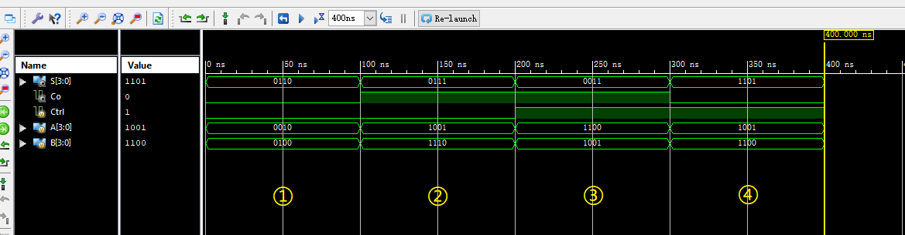

**Analysis:** From the simulation, we can see that the *AddSub4b Module* implemented our target function.

### 5.2 Implement *4-bit ALU Module*

1. The created symbol of "*MyAND2b4*" and "*MyOR2b4*" looks like:

   

2. "Check Design Rules" on module `MyALU` didn't return any errors.

3. Simulation result was as the following:

   

**Analysis:** From the simulation, we can see that the *MyALU Module* implemented our target function.

### 5.3 Sum all things up and make them Operable

1. After modifying user constraint file, the correspondence of the I/O and the Pins (Pinout Report) is as shown in the following figure.

   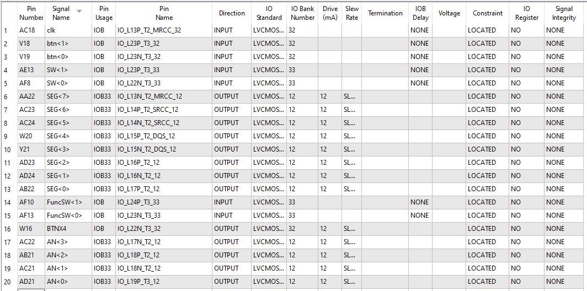

2. The Top Module passed all checks and the programming file was generated successfully.

3. After uploading and operating on the SWORD Board, it was clear that the Top Module worked correctly. All input combinations and outputs satisfied the truth table.

   **Note:** I used the **leftmost 2 switches** to control the mode of `MyALU`, which will be shown in the following pictures.

   **Addition:**

   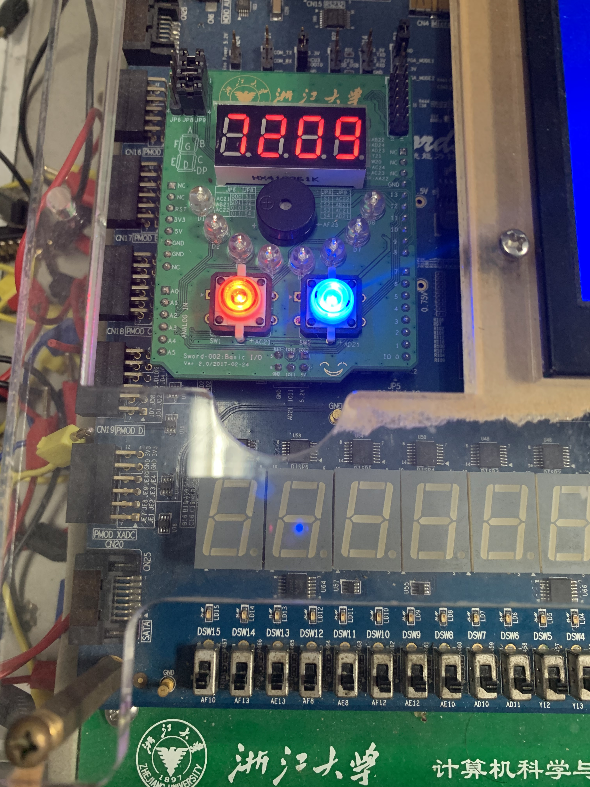

   **Subtraction:**

   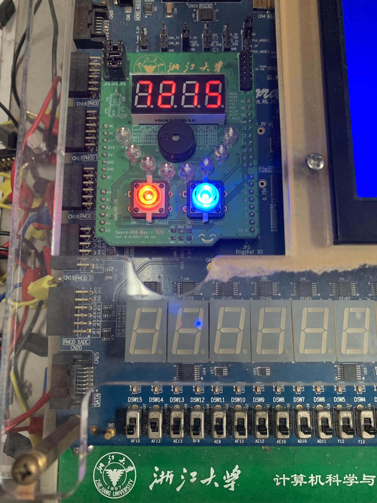

   **AND Operation:**
   
   
   
   **OR Operation:**
   
   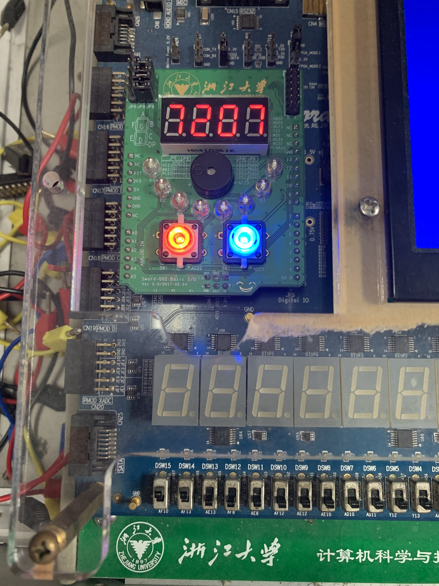

**Analysis:** It can be seen from above pictures that our design has passed the physical verification. And so far, the desired functions of this experiment which were:

1. Operands A & B should be 4-bit;
2. Use two buttons for self-increment / decrement of two operands;
3. Obtain operation result C and carry Co with a self-designed 4-bit ALU;
4. Display A, B, C and Co to the 7-segment digital tube displays.

were correctly implemented. The experiment was successful.

<div style="page-break-after: always;"></div>

# Expr10. Principle and Design of Latches and Flip-Flops

<table align="center">
    <tr>
        <th align="center">Name:</th>
        <td>王浚哲</td>
        <th align="center">ID:</th>
        <td>3180103011</td>
        <th align="center">Major:</th>
        <td>Computer Science and Technology</td>
    </tr>
    <tr>
        <th align="center">Course:</th>
        <td colspan="3">Logic and Computer Design Fundamentals</td>
        <th align="center">Groupmate:</th>
        <td>朱雨轩</td>
    </tr>
    <tr>
        <td align="center"> <b>Date:</b> </td>
        <td> 2019-11-20</td>
        <td align="center"> <b>Place:</b> </td>
        <td> East 4-509 </td>
        <td align="center"> <b>Instructor:</b> </td>
        <td> 洪奇军</td>
    </tr>
</table>

## §1 Purposes & Requirements

1. Master the formation condition and the principle of several kinds of **Latches** and **Flip-Flops**.
2. Master the difference between Latches and Flip-Flops.
3. Master the basic functions of *Basic SR Latch*, *Gated SR Latch*, *D latch*, *SR Master-Slave Flip-Flop* and *D Flip-Flop*.
4. Explore the existing timing problem of *Basic SR Latch*, *Gated SR Latch*, *D Latch,* *SR Master-Slave Flip-Flop* and *D Flip-Flop*.

## §2 Principle & Tasks

### 2.1 Experiment Tasks

1. Implement *Basic SR Latch*, verify its function and understand its timing problems.
2. Implement *Gated SR Latch*, verify its function and understand its timing problems.
3. Implement *D Latch*, verify its function and understand its timing problems.
4. Implement *SR Master-Slave Flip-Flop*, verify its function and understand its timing problems.
5. Implement *D Flip-Flip* and verify its function.

### 2.2 Experiment Principle

#### 2.2.1 Latches Introduction

- Sufficient conditions to compose a Latch are:
  1. The device can maintain a given state for a long term;
  2. The device has two stable states: 0 and 1;
  3. The device can change its state asynchronously under certain conditions.
- Most basic latch types are: *SR Latch* and *D Latch*.

Since a latch has two stable states, it's also called as a **bistable circuit**.

#### 2.2.2 SR Latch

Connect inputs and outputs of two *input inverting logic components* crosswise, and use the other input as the external information input. This constitutes the simplest *SR Latch*.

Since we have both *NOR Gates* and *NAND Gates* as the *input inverting logic components*, there're two different ways to implement our simplest *SR Latch*. Their schematics and state tables are as follows:

##### 1. NOR SR Latch:

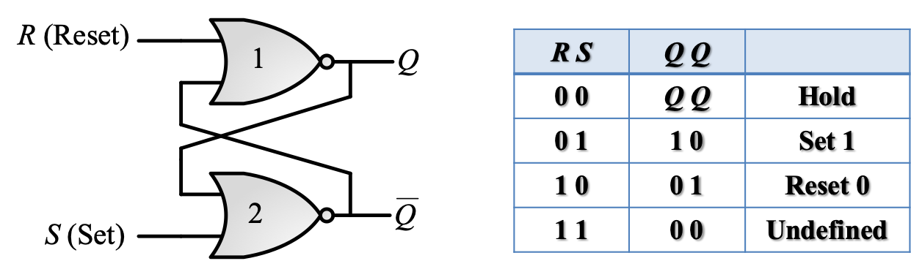

##### 2. NAND SR Latch:

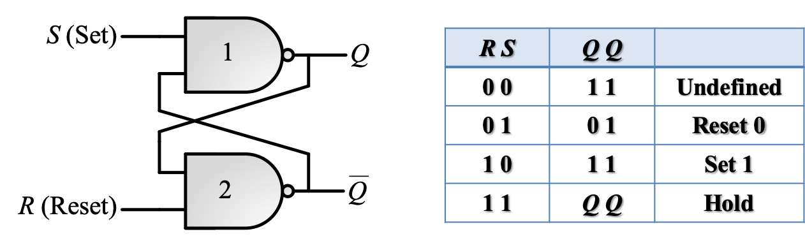

#### 2.2.3 Gated SR Latch

As you may imagine, the simplest *SR Latch* is an **asynchronous** circuit, which means it will change its state whenever the input changes (if defined). The *Gated SR Latch* added a *Control (Clock)* input to determine when the state of the latch should change so that it can be used in a **synchronous** circuit. To implement that function, we add 2 more NAND Gates to the simplest SR Latch shown above, which is like:


The state table tells us that the state of the latch can only be changed during the interval when C = 1.

#### 2.2.4 D Latch

The disadvantage of a *SR Latch* is obvious: it has an **undefined** behavior, which may cause fatal unstable circuit states (e.g. oscillation) and break the entire system down. Fortunately, the solution is also obvious: eliminating the undefined state. That is what a *D Latch* is designed for. 

The *D Latch* has just 1 data input, to which the output is equal. And it also support a control signal, which means that it can be used in a synchronous circuit as well.


#### 2.2.5 Flip-Flop Introduction

There's also a disadvantage about a *D Latch* — it has a phenomenon which is known as **"Data Flip"**. That is, if we use D Latches in a sequential circuit, as long as the *control signal* is valid, the state of the D Latch would change **whenever** the input $D$ changes, rather than remain the original state which is wanted.

Therefore, in order to eliminate the Data Flip phenomenon, we need to come up with a circuit that only changes its internal state 1 time for each *trigger*.

- Trigger(v.): To enable a latch to change its internal state in a transient time interval when an external input comes.
- Trigger(n.): A latch circuit (bistable) which is on the basis of latches and changes its internal state only one time for each trigger.

**The common classification of Flip-Flops:**


Common flip-flops are *Master-Slave SR Flip-Flop*, *D Flip-Flop*, *JK Flip-Flop* and *T Flip-Flop*. However we'll only implement the first two in this experiment.

#### 2.2.6 Master-Slave SR Flip-Flop

An *SR Master-Slave Flip-Flop* is comprised by two clock-controlled *SR Latch* series with the clock signal of the second latch inverted. The following diagram shows its structure:

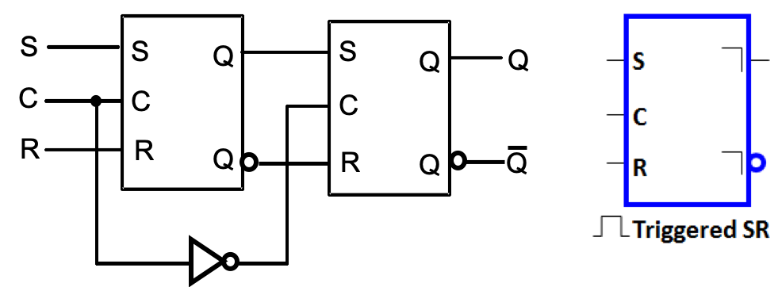

Its behavior follows the following loop:

- When C = 1, the input signal is detected by the left latch (so-called Master latch).
- When C = 0, the output signal of the Master Latch is detected by the right latch (so-called Slave latch) and it produces the final output $Q$.

It can be seen that the path from input to the final output is separated by different clock signal values, so that the "Data Flip" wouldn't propagate all the way through the device.

#### 2.2.7 Positive-Edge Maintain Obstructive D Flip-Flop

Although the *Master-Slave SR Flip-Flop* solved the problem of Data Flip, it has another problem, known as "**1's Catching**". Its shown in the following figure:


The figure above illustrates that if there's a sudden signal of S or R (shorter than the *Control / Clock Signal*), the final output may become something isn't expected.

To solve that problem, we can design some circuit that is only active **at** the edge of the control signal. So, we introduce the *Positive-Edge Maintain Obstructive D Flip-Flop*, which is triggered only at the positive-edge of the $C_P$ signal:

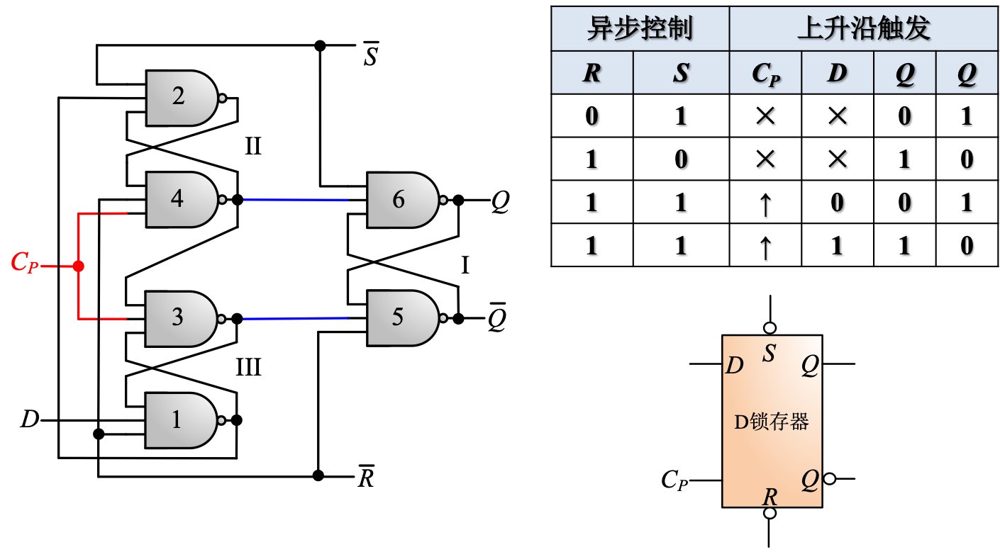

## §3 Main Instruments & Materials

### 3.1 Experiment Instruments

1. A Computer with ISE 14.7 Installed
2. SWORD Board

### 3.2 Experiment Materials

None.

## §4 Experiment Procedure & Operations

### 4.1 Implement *Basic SR Latch*, verify its function and understand its timing problems.

1. Create a new ISE project named "*MyLATCHS*".

   **Note:** Both 5 tasks will be done in this same project.

2. Create a new Schematic source file named "*SR_Latch.sch*".

3. Design the module according to the schematic diagram, using NAND2 Gates.

   

4. Run simulation on `SR_Latch` module, main part of the excitation codes are as follows:

   ```verilog
   // Initialize Inputs
   	initial begin
   		R = 1;	S = 1;	#50;
   		R = 1;	S = 0;	#50;
   		R = 1;	S = 1;	#50;
   		R = 0;	S = 1;	#50;
   		R = 1;	S = 1;	#50;
   		R = 0;	S = 0;	#50;
   		R = 1;	S = 1;	#50;
   	end
   ```

### 4.2 Implement *Gated SR Latch*, verify its function and understand its timing problems.

1. Create a new Schematic source file named "*CSR_Latch.sch*".

2. Design the module according to the schematic diagram, using NAND2 Gates.

   

3. Run simulation on `CSR_Latch` module, show the **Data Flip** phenomenon. Main part of the excitation codes are as follows:

   ```verilog
   // Initialize Inputs
   initial begin
   	C = 0;
   	S = 0;
   	R = 0;
   	
   	#50 S = 1;
   	#50 C = 1;
   	#50 S = 0;
   	#20 R = 1;
   	#40 R = 0;
   	#50 S = 1;
   	#50 C = 0;
   	#20 S = 0;
   end
   ```

4. Generate schematic symbol of `CSR_Latch` module for later use in `MS_FlipFlop`.

### 4.3 Implement *D Latch*, verify its function and understand its timing problems.

1. Create a new Schematic source file named "*D_Latch.sch*".

2. Design the module according to the schematic diagram, using NAND2 Gates.

   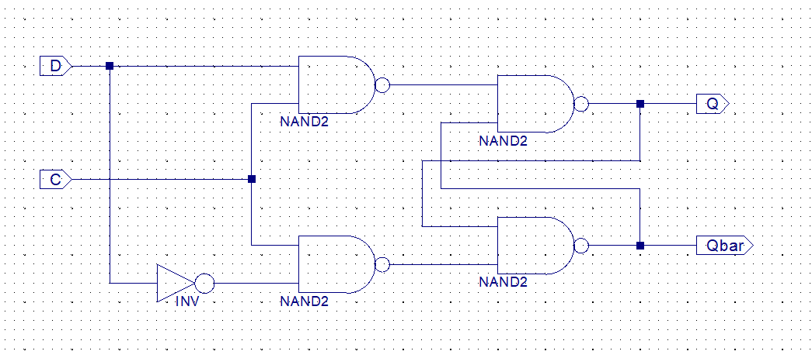

3. Run simulation on `D_Latch` module, show the **Data Flip** phenomenon. Main part of the excitation codes are as follows:

   ```verilog
   // Initialize Inputs
       initial begin
           C = 0;
           D = 0;
   
           #50 D = 1;
           #50 C = 1;
           #50 D = 0;
           #50 D = 1;
           #50 C = 0;
           #20 D = 0;
       end
   ```

### 4.4 Implement *SR Master-Slave Flip-Flop*, verify its function and understand its timing problems.

1. Create a new Schematic source file named "*MS_FlipFlop*".

2. Design the module according to the schematic diagram, invoking the `CSR_Latch` module.

   

3. Run simulation on `MS_FlipFlop` module, show the **1's Catching** phenomenon. Main part of the excitation codes are as follows:

   ```verilog
   // Initialize Inputs
   	always begin
   		#50 C = ~C;
   	end
   	
   	initial begin
   		C = 0;
   		#40 S = 0;
   		R = 0;
   		#100 S = 1;
   		#100 S = 0;
   		#100 R = 1;
   		#100 R = 0;
   		#100 S = 1;	#20 S = 0;
   		#5	  R = 1;	#15 R = 0;
   		#60  S = 1;	#20 S = 0;
   		#140 S = 1; R = 1;
   		#100 S = 0; R = 0;
   	end
   ```


### 4.5 Implement *D Flip-Flip* and verify its function.

1. Create a new schematic source file named as "*D_FlipFlop*"

2. Design the module according to the schematic diagram, using NAND3 Gates.

   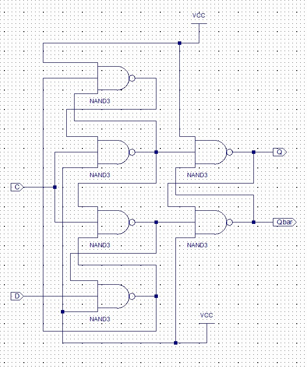

3. Run simulation on `D_FlipFlop` module. Main part of the excitation codes are as follows:

   ```verilog
   // Initialize Inputs
   	initial begin
   		C = 0;
   		D = 0;
   		#125 D = 1;
   		#100 D = 0;
   	end
   	
   	always begin
   		#50 C = ~C;
   	end
   ```

## §5 Results & Analysis

### 5.1 Implement *Basic SR Latch*, verify its function and understand its timing problems.

The simulation result was as the follows:


**Analysis:** From the simulation, we can see that the `SR_Latch` Module implemented our desired function.

### 5.2 Implement *Gated SR Latch*, verify its function and understand its timing problems.

The simulation result was as the follows:


**Analysis:** From the simulation, we can see that the `CSR_Latch` Module implemented our desired function. And the *Data Flip* phenomenon can be seen from the diagram clearly (100ns ~ 300ns).

### 5.3 Implement *D Latch*, verify its function and understand its timing problems.

The simulation result was as the follows:

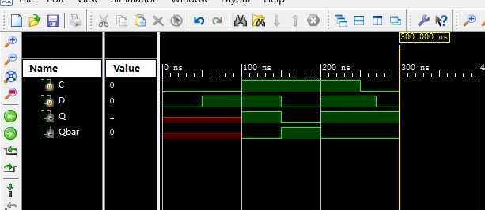

**Analysis:** From the simulation, we can see that the `D_Latch` Module implemented our desired function. And the *Data Flip* phenomenon can be seen from the diagram clearly(100ns ~ 300ns).

### 5.4 Implement *SR Master-Slave Flip-Flop*, verify its function and understand its timing problems.

The simulation result was as the follows:

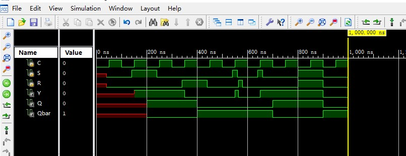

**Analysis:** From the simulation, we can see that the `MS_FlipFlop` Module implemented our desired function. And the *1's Catching* phenomenon can be seen from the diagram clearly (520ns ~ 660ns).

### 5.5 Implement *D Flip-Flip* and verify its function.

The simulation result was as the follows:


**Analysis:** From the simulation, we can see that the `D_FlipFlop` Module implemented our desired function. The experiment was successful.

<div style="page-break-after: always;"></div>

# Expr11. Design of Synchronous Sequential Circuits

<table align="center">
    <tr>
        <th align="center">Name:</th>
        <td>王浚哲</td>
        <th align="center">ID:</th>
        <td>3180103011</td>
        <th align="center">Major:</th>
        <td>Computer Science and Technology</td>
    </tr>
    <tr>
        <th align="center">Course:</th>
        <td colspan="3">Logic and Computer Design Fundamentals</td>
        <th align="center">Groupmate:</th>
        <td>朱雨轩</td>
    </tr>
    <tr>
        <td align="center"> <b>Date:</b> </td>
        <td> 2019-11-27</td>
        <td align="center"> <b>Place:</b> </td>
        <td> East 4-509 </td>
        <td align="center"> <b>Instructor:</b> </td>
        <td> 洪奇军</td>
    </tr>
</table>

## §1 Purposes & Requirements

1. Master the principle and typical design of synchronous sequential circuits.
2. Master the application of excitation functions, state diagrams and state equations of sequential circuits.
3. Master the design, debug and simulation of *finite state machine* with Verilog HDL.
4. Master the implementation of sequential circuits with FPGA.

## §2 Principle & Tasks

### 2.1 Experiment Tasks

1. Implement a 4-bit binary synchronous counter using schematic diagram.
2. Implement a 16-bit reversible binary synchronous counter.

### 2.2 Experiment Principle

#### 2.2.1 4-bit Binary Synchronous Counter

A *Binary Synchronous Counter* is a sequential circuit which increase its own output binary code by 1 every time the *Clock Signal* is 1. 

From its function, we obtain its state table:


After K-map simplification of all the 4 outputs, we now have state functions for all next states of the counter:
$$
Q_A^{n+1} = \overline{Q_A} \\
Q_B^{n+1} = \overline{\overline{Q_A} \otimes \overline{Q_B}} \\
Q_C^{n+1} = \overline{ ( \overline{\overline{Q_A} + \overline{Q_B} ) } \otimes \overline{Q_C}} \\
Q_D^{n+1} = \overline{ ( \overline{\overline{Q_A} + \overline{Q_B} + \overline{Q_C} ) } \otimes \overline{Q_D}} \\
$$
And the output function for carry *Rc*:
$$
R_C = \overline{ \overline{Q_A} + \overline{Q_B} + \overline{Q_C} + \overline{Q_D} } = Q_A Q_B Q_C Q_D\\
$$
According to these output functions, we will design the *4-bit Binary Synchronous Counter* using schematic in $\sect4$.

#### 2.2.2 4-bit Reversible Binary Synchronous Counter

The *Reversible Binary Synchronous Counter* can be controlled by $S$ to select in forward mode or reversed mode should the counter counts.

- When S = 1, the counter counts in the ascending mode.
- When S = 0, the counter counts in the descending mode.

A 4-bit reversible counter has output functions like this:


Since all the functions above is definitely making people dizzy and no one  is willing to do all those wirings, we'll use *Behavior Description* to implement the reversible counter. See $\sect4$.

#### 2.2.3 Auxiliary Module: Frequency Divider

We've known from previous experiments that the SWORD Board generates clock signals at a frequency of **100MHz**, but obviously we don't want our counters do those counts every 1/100,000,000s. Thus we need to design a module that helps us reduce the frequency input to our counters to a human-acceptable range (e.g. 1~10Hz).

The system-generated clock of 100MHz will be divided by 50,000,000 time to obtain a 1Hz square wave which will be used to trigger our counters.

The codes of implementation can be seen in $\sect4$.

## §3 Main Instruments & Materials

### 3.1 Experiment Instruments

1. A Computer with ISE 14.7 Installed
2. SWORD Board

### 3.2 Experiment Materials

None.

## §4 Experiment Procedure & Operations

### 4.1 Implement a 4-bit binary synchronous counter using schematic diagram

1. Create a new ISE project named "*MyCounter*" with Top Level Source Type *HDL*.

2. Create a new Schematic source file named "*Counter4b*".

3. Design the module according to the schematic diagram.

   

4. Run simulation on `Counter4b` module, main part of the excitation codes are as follows:

   ```verilog
   // Initialize Inputs
   	initial clk = 0;
   	always begin
   		#20 clk = ~clk;
   	end
   ```

5. Create a new Verilog HDL source file named "*clk_1s.v*" and use *Behavior Description* to implement a *1Hz Oscillation Circuit*. The code is like the follows:

   ```verilog
   module clk_1s(		// Generate 1Hz signal from the on-board 100MHz clock signal
   	input wire clk,
   	output reg clk_1s
      );
   	reg [31:0] cnt;
   	
   	initial begin
   		cnt = 0;
   		clk_1s = 0;
   	end
   	
   	always @ ( posedge clk ) begin
   		if ( cnt < 50_000_000 ) cnt <= cnt + 1;
   		else begin
   			cnt <= 0;
   			clk_1s <= ~clk_1s;
   		end
   	end
   endmodule
   ```

6. Create a new Verilog HDL source file "*Top.v*" and set it as the top module. 

   - Invoke the 4-bit counter we just designed and use the 1s-period clock signal generated by `clk_1s` module as its timing input. 
   - Invoke `disp_num` module to display the 4-bit binary information on one of the 4 7-segment digital tube displays. 
   - And use 1 LED light to indicate the carry output `Rc`.

   ```verilog
   module top(		// Top Module of project "MyCounter"
   	input wire clk,
   	output wire [7:0] SEG,
   	output wire [3:0] AN,
   	output wire Rc
      );
   	
   	wire clk_1s;
   	wire [3:0] Q;
   
   	clk_1s clk1s(clk, clk_1s);
   	
   	Counter4b u1(.clk(clk_1s), .Qa(Q[0]), .Qb(Q[1]), .Qc(Q[2]), .Qd(Q[3]), .Rc(Rc));
   	
   	disp_num u2(.clk(clk), .RST(1'b0), .HEXS({12'b0,Q}), .point(4'b0), .LES(4'b1110), .Segment(SEG), .AN(AN));
   
   endmodule
   ```

7. Generate Programming File and upload our design to the SWORD Board, check its behavior. A digit which increases by 1 every second and loop between 0~F should be displayed on the rightmost 7-segment display.

### 4.2 Implement a 16-bit reversible binary synchronous counter

1. Create a new ISE project named "*MyRevCounter*" with Top Level Source Type *HDL*.

2. Create a new Verilog HDL source file named "*CounterRev16b.v*". 

3. Use behavior description to implement a 16-bit reversible binary synchronous counter:

    ```verilog
   module CounterRev16b(	// A 16-bit Reversible Binary Synchronous Counter
   	input wire clk, S,
   	output reg [15:0] cnt,
   	output wire Rc		// Carry bit
   	);
   	
   	initial cnt = 0;
   	
   	assign Rc = (~S & (~|cnt)) | (S & (&cnt));
   	
   	always @ (posedge clk)
   		if (S) cnt <= cnt + 1;
   		else cnt <= cnt - 1;
   
   endmodule
    ```

4. Run simulation on `CounterRev16b` module which should cover both forward and reversed modes. Main part of the excitation codes are as follows:

   ```verilog
   initial begin
       // Initialize Inputs
       clk = 0;
       S = 0;		// Reversed mode
   
       // Wait 100 ns for global reset to finish
       #32768;		// This interval is large in order to see more data
       S = 1;		// Forward mode
   end
   
   always #5 clk = ~clk;
   ```

5. Since we now have 16 bits storing information, a 1Hz clock is somehow too "slow" for it. We need a higher frequency clock to make things more human-acceptable. Therefore, create a new module `clk_100ms` to generate 100ms-period clock signal for our new counter.

   ```verilog
   module clk_100ms(
   	input wire clk,
   	output reg clk_100ms
      );
   	integer cnt;
   	
   	initial begin
   		cnt = 0;
   		clk_100ms = 0;
   	end
   	
   	always @ ( posedge clk ) begin
   		if ( cnt < 5_000_000 ) cnt <= cnt + 1;
   		else begin
   			cnt <= 0;
   			clk_100ms <= ~clk_100ms;
   		end
   	end
   endmodule
   ```

6. Like the previous project, create a new Verilog HDL source file "*Top.v*" and set it as the top module. 

   - Invoke the 16-bit reversible counter `CounterRev16b` we just designed and use the 100ms-period clock signal generated by `clk_100ms` module as its timing input. 
   - Add an input `SW` to determine the mode our counter would operate on.
   - Invoke `disp_num` module to display the 16-bit binary information on 4 7-segment digital tube displays. 
   - And use 1 LED light to indicate the carry output `Rc`.

   ```verilog
   module top(
   	input wire clk,
   	input wire SW,
   	output wire [7:0] SEG,
   	output wire [3:0] AN,
   	output wire Rc
      );
   	
   	wire clk_100ms;
   	wire [15:0] num;
   
   	clk_100ms m1(clk, clk_100ms);
   	
   	CounterRev16b m2(clk_100ms, SW, num, Rc);
   	
   	disp_num m3(.clk(clk), .RST(1'b0), .HEXS(num), .point(4'b0010), .LES(4'b0), .Segment(SEG), .AN(AN));
   endmodule
   ```

7. Generate Programming File and upload our design to the SWORD Board, check its behavior. 4 digits which increases by `4'b0001` every 100ms and loop between "0000"~"FFFF" should be displayed on the 4 7-segment displays.

## §5 Results & Analysis

### 5.1 Implement a 4-bit binary synchronous counter using schematic diagram

1. The simulation result was as the follows:

   

   From the simulation result we can see that `Counter4b` Module implemented the desired function.

2. The Top Module passed all checks and the programming file was generated successfully.

3. After uploading and operating onto the SWORD Board, it was clear that the Top Module worked correctly. The changing digit indicates that it was an 1s counter.

   **Note:** Since a static image won't help explain anything about this dynamic process of counting, I dropped it out here. But in practice it was REALLY implemented.

**Analysis:** From the result we can conclude that the `Counter4b` Module has implemented our desired function.

### 5.2 Implement a 16-bit reversible binary synchronous counter

1. The simulation results were as the follows:

   **Increasing Mode:**

   

   **Decreasing Mode:**

   

   From the simulation result we can see that `CounterRev16b` Module implemented the desired function.

2. The Top Module passed all checks and the programming file was generated successfully.

3. After uploading and operating onto the SWORD Board, it was clear that the Top Module worked correctly. The changing digits indicates that it was an 100ms counter (timer).

   **Note:** Since a static image won't help explain anything about this dynamic process of counting, I dropped it out here. But in practice it was REALLY implemented.

**Analysis:** From the result we can conclude that the `CounterRev16b` Module has implemented our desired function.

<div style="page-break-after: always;"></div>

# Overall Experience

In Experiment 9, I learned something really essential for a CPU — the structure and function of an *Arithmetic & Logic Unit* (ALU). Although it was only a 4-bit version, it has deepened my understanding about the fundamentals of computer structure. 

From experiment 10, we've entered a brand new realm of the LCDF Course — *Sequential Logic Circuits*. It involved something new: states, timing, latches, triggers and so on. We're now considering TIME, which was never mentioned in the *Combinational Logic Circuits* part. I've learned how a single bit of information is stored in a computer, and how a counter was built up.

Another significant lesson learned was about the Verilog HDL programming language. We were gradually turning from schematic designs into code designs. What I've learnt a lot was the syntax and how powerful the Verilog HDL language is. Besides the fact that the experiments were done successfully, I'd say I've also gained a lot. 